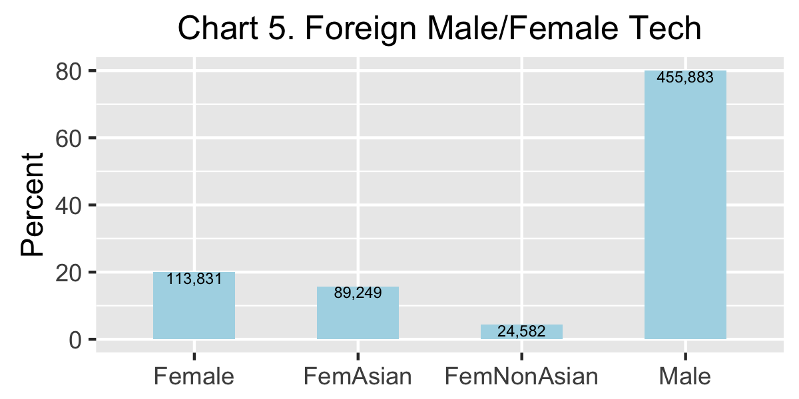

```{r LOAD, echo=FALSE, cache=FALSE}

    #### load("dfRaceWorkplaceAndShares.rda") ### Only use data in tables, plots, and maps
    load("dfCensus2.rda") 
    load("dfTab1A1B2A2B3ABCDEF.rda")
    load("dfTab4.rda")   
    load("dfMap4.rda")
    load("dfPlot5Tab5beta1000.rda")
    load("dfTab67A7B7C7D7E7F8A8B8C8D8E8F.rda")
    load("APPENDIX.rda") 
    
    
    
    ###install.packages("gridExtra")
    library(prettydoc)
    library(maps)    
    library(mapproj) ### needed by ggplot2, but not installed automaticallly
    library(ggplot2)
    library(gridExtra)
    ### library(printr)
    library(grid)
    library(gtable)
    library(grid)

    ### Intending to use Yihui Xie's printr package for better tables later
    ### install.packages("devtools")
    ### library(devtools)
    ### install_github("yihui/printr")
    ### library(printr)
    ### detach('package:printr', unload = TRUE)
    
tt3 <- ttheme_minimal(
  core=list(bg_params = list(fill = blues9[1:7], col=NA),
            fg_params=list(fontface=3)),
  colhead=list(fg_params=list(col="navyblue", fontface=4L)),
  rowhead=list(fg_params=list(col="orange", fontface=3L)))

fem10 <- round(dfTable3ZZ[1, "Tech10"] * dfTable3ZZ[1, "perF10"]/100, digits=0) ### calculate females in 2010 from female share
perFemIncrease <- round(100 * (dfTable3Z[1,"Fem"] - fem10)/fem10, digits=1)

```
\pagenumbering{arabic}   
  
<P style="page-break-before: always">  
## Overview   

Top managers claim that American firms in the U.S. technology sector employ foreign professionals because they cannot find enough qualified American techs in the domestic job pipelines. This supplement uses Census data to estimate the employment of foreign techs in the 50 states plus the District of Columbia in 2015 and to estimate the increase in the employment of foreign techs between 2010 and 2015.  

<i>Please note that all of the numbers in this overview and in the subsequent sections of this supplement are estimates based on U.S. Census survey samples. Accordingly all numbers should be read as "approximately" even when the word "approximately" does not appear. </i>  

* In 2015, there were approximately `r prettyNum(dfTable1C["Num", "Total2015"], big.mark=",", scientific=FALSE)` professionals in the U.S. tech sector; `r prettyNum(dfTable1C["Num", "Citizens2015"], big.mark=",", scientific=FALSE)` were Americans (`r prettyNum(dfTable1C["Per", "Citizens2015"], big.mark=",", scientific=FALSE)` percent); `r prettyNum(dfTable1C["Num", "Foreign2015"], big.mark=",", scientific=FALSE)` were foreign (`r prettyNum(dfTable1C["Per", "Foreign2015"], big.mark=",", scientific=FALSE)` percent, Table 1C).   

* In 2015 approximately `r prettyNum(dfTable2C["Per", "Male"], big.mark=",", scientific=FALSE)`% of foreign techs were male; `r prettyNum(dfTable2C["Per", "Female"], big.mark=",", scientific=FALSE)`% were female; `r prettyNum(dfTable2C["Per", "FemAsian"], big.mark=",", scientific=FALSE)`% of foreign techs were female techs who came from Asian countries; and `r prettyNum(dfTable2C["Per", "FemNonAsian"], big.mark=",", scientific=FALSE)`% were female techs from non-Asian countries. (Chart 5 and Table 2C)

  
  
* More than half, i.e., `r prettyNum(dfTable4.1[1, "perTop6"], big.mark=",", scientific=FALSE)` percent, of foreign techs were concentrated in six states (Chart 5 and Table 4.1) ==> California (`r prettyNum(dfTable4.1[1, "California"], big.mark=",", scientific=FALSE)`), Texas (`r prettyNum(dfTable4.1[1, "Texas"], big.mark=",", scientific=FALSE)`), New York (`r prettyNum(dfTable4.1[1, "New York"], big.mark=",", scientific=FALSE)`), New Jersey (`r prettyNum(dfTable4.1[1, "New Jersey"], big.mark=",", scientific=FALSE)`), Washington (`r prettyNum(dfTable4.1[1, "Washington"], big.mark=",", scientific=FALSE)`), and Illinois (`r prettyNum(dfTable4.1[1, "Illinois"], big.mark=",", scientific=FALSE)`). These states also experienced the largest increases in the employment of foreign techs between 2010 and 2015 (Chart 6 and Table 4.1).

  

* Employment of foreign techs in the 50 states plus the District of Columbia increased by `r prettyNum(dfTable3EE[1, "perCh"], big.mark=",", scientific=FALSE)` percent between 2010 and 2015 (Table 3EE). By contrast, employment of American techs only increased by `r prettyNum(dfTable3ZZ[1, "perCh"], big.mark=",", scientific=FALSE)` percent (Table 3ZZ) during that time frame.   

* In recent years cloud computing and machine learning became principal drivers in the expansion of the U.S. tech sector. Therefore contrasts between the increase in American vs. foreign tech employment in three job categories are especially noteworthy ==> software developers, database administrators, and computer/research scientists.  

* American firms increased their employment of foreign software developers from `r prettyNum(dfTable3EE[dfTable3EE$Occupation=="SOFTWARE DEVELOPERS", "Tech10"], big.mark=",", scientific=FALSE)` in 2010 to `r prettyNum(dfTable3EE[dfTable3EE$Occupation=="SOFTWARE DEVELOPERS", "Tech15"], big.mark=",", scientific=FALSE)` in 2015, i.e., a `r prettyNum(dfTable3EE[dfTable3EE$Occupation=="SOFTWARE DEVELOPERS", "perCh"], big.mark=",", scientific=FALSE)` percent increase (Table 3EE). American firms increased their employment of American software developers by only `r prettyNum(dfTable3ZZ[dfTable3ZZ$Occupation=="SOFTWARE DEVELOPERS", "perCh"], big.mark=",", scientific=FALSE)` percent between 2010 and 2015 (Table 3ZZ)

* American firms increased their employment of foreign database administrators from `r prettyNum(dfTable3EE[dfTable3EE$Occupation=="DATABASE ADMINISTRATORS", "Tech10"], big.mark=",", scientific=FALSE)` in 2010 to `r prettyNum(dfTable3EE[dfTable3EE$Occupation=="DATABASE ADMINISTRATORS", "Tech15"], big.mark=",", scientific=FALSE)` in 2015, i.e, a `r prettyNum(dfTable3EE[dfTable3EE$Occupation=="DATABASE ADMINISTRATORS", "perCh"], big.mark=",", scientific=FALSE)` percent increase (Table 3EE).  American firms increased their employment of American database admiistrators by only `r prettyNum(dfTable3ZZ[dfTable3ZZ$Occupation=="DATABASE ADMINISTRATORS", "perCh"], big.mark=",", scientific=FALSE)` percent between 2010 and 2015 (Table 3ZZ)

* American firms increased their employment of foreign computer/research scientists from `r prettyNum(dfTable3EE[dfTable3EE$Occupation=="COMP/INFO RESEARCH SCIENTISTS", "Tech10"], big.mark=",", scientific=FALSE)` in 2010 to `r prettyNum(dfTable3EE[dfTable3EE$Occupation=="COMP/INFO RESEARCH SCIENTISTS", "Tech15"], big.mark=",", scientific=FALSE)` in 2015, i.a., a `r prettyNum(dfTable3EE[dfTable3EE$Occupation=="COMP/INFO RESEARCH SCIENTISTS", "perCh"], big.mark=",", scientific=FALSE)` percent increase (Table 3EE).  American firms increased their employment of American computer/research scientists by only `r prettyNum(dfTable3ZZ[dfTable3ZZ$Occupation=="COMP/INFO RESEARCH SCIENTISTS", "perCh"], big.mark=",", scientific=FALSE)` percent between 2010 and 2015 (Table 3ZZ)  

* In 2015 California employed the largest number of foreign techs in all three categories ==> software developers = `r prettyNum(dfTable3G[dfTable3G$Occupation=="SOFTWARE DEVELOPERS" & dfTable3G$State=="California", "Tech15"], big.mark=",", scientific=FALSE)`; database administrators = `r prettyNum(dfTable3G[dfTable3G$Occupation=="DATABASE ADMINISTRATORS" & dfTable3G$State=="California", "Tech15"], big.mark=",", scientific=FALSE)`; and computer/research scientists = `r prettyNum(dfTable3G[dfTable3G$Occupation=="COMP/INFO RESEARCH SCIENTISTS" & dfTable3G$State=="California", "Tech15"], big.mark=",", scientific=FALSE)`. California also recruited the largest increases in foreign techs between 2010 and 2015 ==> software developers =  `r prettyNum(dfTable3G[dfTable3G$Occupation=="SOFTWARE DEVELOPERS" & dfTable3G$State=="California", "Change"], big.mark=",", scientific=FALSE)` ...  database administrators =  `r prettyNum(dfTable3G[dfTable3G$Occupation=="DATABASE ADMINISTRATORS" & dfTable3G$State=="California", "Change"], big.mark=",", scientific=FALSE)` ... and computer/research scientists =  `r prettyNum(dfTable3G[dfTable3G$Occupation=="COMP/INFO RESEARCH SCIENTISTS" & dfTable3G$State=="California", "Change"], big.mark=",", scientific=FALSE)` (Table 3F)

These estimates of substantial employment of foreign techs in 2015 and substantial increases in the employment of foreign techs between 2010 and 2015 were consistent with managers' claims that they were using foreign job pipelines to cover shortfalls in the availability of qualified American techs in the domestic job pipelines. 

But it must be noted that substantial increases in the employment of foreign techs were also consistent with an alternative interpretation, i.e., that American managers were importing foreign labor because it was cheaper than American labor. In other words domestic job pipelines did not contain enough American techs who were willing to work for the lower salaries that were acceptable to foreign techs. This is not to say that foreign techs were paid salaries that were below the salary ranges paid to American techs, merely that larger numbers of foreign techs were willing to work for salaries that were at the lower end of the salary ranges offered to American techs.

Only a small percentage of the top managers in any economic sector are "disruptors" or "innovators". Most  tend to implement "best practices" as identified by whatever the most successful top managers in their sectors are doing. In the case of U.S. tech, the most successful top managers are in California, and California's tech sector employs a much higher percentage of foreign techs than the tech sectors in other states. So that's what we should expect the top managers in the tech sectors of other states will do in the next five years ==> employ higher percentages of foreign techs.

<b>Unfortunately, assigning larger and larger percentages of the jobs in U.S. tech to foreign professionals conflicts with the public commitments of the sector's top managers to make tech more diversified by hiring larger percentages of Black and Hispanic professionals.</b>

<small><i><center><a href="https://archimedes2kxx.github.io/BestStatesForBlackTech/Supplement-3.html" target="_self">back-to-top</a></center></i></small>   
  
<P style="page-break-before: always">  
## Findings   

Brief answers to the first two questions provide a framwork for the extended responses to the third and fourth questions that form the core of this supplement.   

<i>Note: The tables, maps, and charts in this supplement about foreign techs have been assigned numbers that follow the numbers of similar tables, maps, and charts in the original report about American techs. For example, Tables 3E and 3F appear in ths supplement because Tables 3A, 3B, 3C, and 3D appeared in the original. On the other hand a few tables from the original are repeated in this supplement as convenient references for the reader and are assigned the same numbers as in the original; for example, Tables 1C and 1E.</i>

<i>Note:  The appearance of zeros in most tables should not be interpreted as literal zeros, but as standins for missing values wherever the Census sample was too small to enable reliable estimates.</i>

#### Question 1 -- How many foreign professionals worked in the U.S. tech sector in 2015?

<i>Answer 1C</i> ... As can be seen from Table 1C (below), `r dfTable1C["Per", "Foreign2015"]` percent of the employees in the U.S. tech sector in 2015 were foreign professionals, a small increase over the `r dfTable1C["Per", "Foreign2010"]` percent share held by foreign professionals in 2010. 

<b>Table 1C -- American and Foreign Components of the U.S. Tech Sector in 2010 and 2015</b>    
```{r, echo=FALSE, cache=FALSE, comment=NA}
   print(dfTable1C, row.names=TRUE, quote=FALSE)
```

<i>Question 1E</i> -- How many Asian and non-Asian foreign employees were in U.S. tech in the 50 states plus the District of Columbia in 2015? 

<i>Answer 1E</i> ...  As per Table 1E (below), there were more than twice as many foreign professionals from Asian countries as from other countries in U.S. tech in 2015.
  
<b>Table 1E -- Foreign Asian and Non-Asian Components of the U.S. Tech Sector in 2015</b> 
```{r, echo=FALSE, cache=FALSE, comment=NA}
   print(dfTable1E, row.names=TRUE, quote = FALSE)
```
<small><i><center><a href="https://archimedes2kxx.github.io/BestStatesForBlackTech/Supplement-3.html" target="_self">back-to-top</a></center></i></small>   

#### Question 2 -- What was the foreign male/female composition of U.S. tech in 2015?
<i>Answer 2</i> ... In 2015 approximately `r prettyNum(dfTable2C["Per", "Male"], big.mark=",", scientific=FALSE)`% of foreign techs were male; `r prettyNum(dfTable2C["Per", "Female"], big.mark=",", scientific=FALSE)`% were female; `r prettyNum(dfTable2C["Per", "FemAsian"], big.mark=",", scientific=FALSE)`% of foreign techs were female techs who came from Asian countries; and `r prettyNum(dfTable2C["Per", "FemNonAsian"], big.mark=",", scientific=FALSE)`% were female techs from non-Asian countries. (Chart 4 and Table 2C)


<b>Table 2C -- Foreign Male/Female Components of the U.S. Tech Sector in 2015</b> 
```{r, echo=FALSE, cache=FALSE, comment=NA}
   print(dfTable2C, row.names=TRUE, quote = FALSE)
```
<small><i><center><a href="https://archimedes2kxx.github.io/BestStatesForBlackTech/Supplement-3.html" target="_self">back-to-top</a></center></i></small>   

#### Question 3 -- How did the foreign shares of jobs in U.S. tech change between 2010 and 2015?    

<i>Answer 3</i> ... The first two tables in this section, Table 3Z and Tables 3ZZ, were copied from the original report. They provide profiles of the jobs held by American professionals in the U.S. tech sector. Subsequent tables in this section provide increasingly detailed profiles of the jobs held by foreign professionals. These foreign profiles can be interpreted as specific measures of the substantial shortfalls in the supply of American techs. Alternatively, they can be also interpreted as specific measures of the extent to thich American managers imported cheaper labor from foreign sources than was available from the nation's domestic pipelines. 

This supplement defined "information technology" by using the same thirteen standard occupation categories (SOC) as in the original report. Twelve categories were related to software, e.g., Software Developers and Computer Programmers; one related to hardware, i.e., Computer Hardware Engineers.     

The first column of each profile contains a list of job categories. Some categories were abbreviated to enable the rows of the table to be short enough to appear on the same line when published on the DLL's blog. Abbreviations include "Comp" for "Computer", "Info" for "Information", and "Net" for "Network". Column headings were also abbreviated as follows:   

* <b>Tech10</b> ... number of tech workers in each job category in 2010   

* <b>Tech15</b> ... number of tech workers in each job category in 2015   

* <b>perTS</b> ... "Percentage of Tech Share", which shows the percentage of the total number of American tech workers that were employed in each job category in the 50 states plus the District of Columbia. For example, in Table 3Z (below) the `r prettyNum(dfTable3Z["SOFTWARE DEVELOPERS", "Tech15"], big.mark=",", scientific=FALSE)` workers in "Software Development" represented `r prettyNum(dfTable3Z["SOFTWARE DEVELOPERS", "perTS"], big.mark=",", scientific=FALSE)` percent of the `r prettyNum(dfTable3Z["All Occupations", "Tech15"], big.mark=",", scientific=FALSE)` total American tech workers in 2015. The `r prettyNum(dfTable3Z["COMP PROGRAMMERS", "Tech15"], big.mark=",", scientific=FALSE)` workers "Computer Programmers" were `r prettyNum(dfTable3Z["COMP PROGRAMMERS", "perTS"], big.mark=",", scientific=FALSE)` percent of the total `r prettyNum(dfTable3Z["All Occupations", "Tech15"], big.mark=",", scientific=FALSE)`.   

* <b>Fem</b> ... number of "Female" tech workers". The number of males can be calculated by substracting the female workers from the total number of workers in each category. For example, in Table 3Z (below) there were `r prettyNum(dfTable3Z["SOFTWARE DEVELOPERS", "Tech15"], big.mark=",", scientific=FALSE)` American software developers in the 50 states plus DC in 2015 of which `r prettyNum(dfTable3Z["SOFTWARE DEVELOPERS", "Fem"], big.mark=",", scientific=FALSE)` were female. So the number of male software developers was `r prettyNum(dfTable3Z["SOFTWARE DEVELOPERS", "Tech15"], big.mark=",", scientific=FALSE)` - `r prettyNum(dfTable3Z["SOFTWARE DEVELOPERS", "Fem"], big.mark=",", scientific=FALSE)` = `r prettyNum((dfTable3Z["SOFTWARE DEVELOPERS", "Tech15"] - dfTable3Z["SOFTWARE DEVELOPERS", "Fem"]), big.mark=",", scientific=FALSE)`. 

* <b>perF15</b> ... "Percent Female in 2015" displays the percent of jobs in each category that were held by female techs in 2015. For example, Table 3Z shows that the `r prettyNum(dfTable3Z["SOFTWARE DEVELOPERS", "Fem"], big.mark=",", scientific=FALSE)` female software developers were `r prettyNum(dfTable3Z["SOFTWARE DEVELOPERS", "perF15"], big.mark=",", scientific=FALSE)` percent of the total `r prettyNum(dfTable3Z["SOFTWARE DEVELOPERS", "Tech15"], big.mark=",", scientific=FALSE)`

* <b>perF10</b> ... "Percent Female in 2010" displays the percent of jobs in each category that were held by female techs in 2010. This stat is always contained in the companion table, e.g., Table 3ZZ.

* <b>Change</b> ... difference between the number of workers in each job category in 2010 and the number in 2015. This stat is always found in the companion table, e.g., Table 3ZZ. 

* <b>perCh</b> ... change from 2010 to 2015 as a percentage of the jobs in 2010.  

<small><i><center><a href="https://archimedes2kxx.github.io/BestStatesForBlackTech/Supplement-3.html" target="_self">back-to-top</a></center></i></small>  


<b> American Female vs. Foreign Female Techs in 2010 and 2015 ... Tables 3Z/3ZZ vs Tables 3E/3EE</b>   

* U.S. tech employed more foreign female professionals in 2015 than in 2010. Nevertheless, the percentage of the foreign tech workforce that was female declined from `r prettyNum(dfTable3EE[1, "perF10"], big.mark=",", scientific=FALSE)`% in 2010 down to `r prettyNum(dfTable3E[1, "perF15"], big.mark=",", scientific=FALSE)`% in 2015 (Tables 3E and 3EE). A similar decline in the female component of the American tech workforce also occurred, from `r prettyNum(dfTable3ZZ[1, "perF10"], big.mark=",", scientific=FALSE)`% in 2010 down to `r prettyNum(dfTable3Z[1, "perF15"], big.mark=",", scientific=FALSE)`% in 2015 (Tables 3Z and 3ZZ). 

* In recent years cloud computing and machine learning became principal drivers in the expansion of the U.S. tech sector. Therefore contrasts between the increase in American vs. foreign tech employment in three job categories are especially noteworthy ==> software developers, database administrators, and computer/research scientists.  

* The percentage of the foreign female software developers declined from `r prettyNum(dfTable3EE[dfTable3EE$Occupation=="SOFTWARE DEVELOPERS", "perF10"], big.mark=",", scientific=FALSE)`% in 2010 down to `r prettyNum(dfTable3E[dfTable3E$Occupation=="SOFTWARE DEVELOPERS", "perF15"], big.mark=",", scientific=FALSE)`% in 2015 (Tables 3E and 3EE). The female component of American software developers also declined, from `r prettyNum(dfTable3ZZ[dfTable3ZZ$Occupation=="SOFTWARE DEVELOPERS", "perF10"], big.mark=",", scientific=FALSE)`% in 2010 down to `r prettyNum(dfTable3Z[dfTable3ZZ$Occupation=="SOFTWARE DEVELOPERS", "perF15"], big.mark=",", scientific=FALSE)`% in 2015 (Tables 3Z and 3ZZ).

* The percentage of the foreign female database administrators declined from `r prettyNum(dfTable3EE[dfTable3EE$Occupation=="DATABASE ADMINISTRATORS", "perF10"], big.mark=",", scientific=FALSE)`% in 2010 down to `r prettyNum(dfTable3E[dfTable3E$Occupation=="DATABASE ADMINISTRATORS", "perF15"], big.mark=",", scientific=FALSE)`% in 2015 (Tables 3E and 3EE). The female component of American database administrators also declined, from `r prettyNum(dfTable3ZZ[dfTable3ZZ$Occupation=="DATABASE ADMINISTRATORS", "perF10"], big.mark=",", scientific=FALSE)`% in 2010 down to `r prettyNum(dfTable3Z[dfTable3Z$Occupation=="DATABASE ADMINISTRATORS", "perF15"], big.mark=",", scientific=FALSE)`% in 2015 (Tables 3Z and 3ZZ).   

* The percentage of the foreign female computer/research scientists declined from `r prettyNum(dfTable3EE[dfTable3EE$Occupation=="COMP/INFO RESEARCH SCIENTISTS", "perF10"], big.mark=",", scientific=FALSE)`% in 2010 down to `r prettyNum(dfTable3E[dfTable3E$Occupation=="COMP/INFO RESEARCH SCIENTISTS", "perF15"], big.mark=",", scientific=FALSE)`% in 2015 (Tables 3E and 3EE). The female component of the American computer/research scientists also declined, from `r prettyNum(dfTable3ZZ[dfTable3ZZ$Occupation=="COMP/INFO RESEARCH SCIENTISTS", "perF10"], big.mark=",", scientific=FALSE)`% in 2010 down to `r prettyNum(dfTable3Z[dfTable3Z$Occupation=="COMP/INFO RESEARCH SCIENTISTS", "perF15"], big.mark=",", scientific=FALSE)`% in 2015 (Tables 3Z and 3ZZ).  

* These declines in female shares of both the foreign and American components of the U.S. tech workforce in all three critical areas might be explained by domestic and global shortages of qualified female techs ... Or these declines might reflect gender bias among U.S. managers against hiring female techs, a bias that transcended the female techs' status as foreigners or as citizens.

<small><i><center><a href="https://archimedes2kxx.github.io/BestStatesForBlackTech/Supplement-3.html" target="_self">back-to-top</a></center></i></small>

<P style="page-break-before: always">   
 <b>Table 3Z -- American Male/Female Composition of U.S. Tech in 2015</b> 
```{r, echo=FALSE, cache=FALSE, comment=NA}
   print(format(dfTable3Z, big.mark=","), row.names=FALSE, quote=FALSE)
```

 <b>Table 3ZZ -- Changes in the American Composition of U.S. Tech Between 2010 and 2015</b> 
```{r, echo=FALSE, cache=FALSE, comment=NA}
   print(format(dfTable3ZZ, big.mark=","), row.names=FALSE, quote=FALSE)
```
<small><i><center><a href="https://archimedes2kxx.github.io/BestStatesForBlackTech/Supplement-3.html" target="_self">back-to-top</a></center></i></small>  

<P style="page-break-before: always">   
 <b>Table 3E -- Foreign Male/Female Composition of U.S. Tech in 2015</b> 
```{r, echo=FALSE, cache=FALSE, comment=NA}
   print(format(dfTable3E, big.mark=","), row.names=FALSE, quote=FALSE)
```

 <b>Table 3EE -- Changes in the Foreign Composition of U.S. Tech Between 2010 and 2015</b> 
```{r, echo=FALSE, cache=FALSE, comment=NA}
   print(format(dfTable3EE, big.mark=","), row.names=FALSE, quote=FALSE)
```
<small><i><center><a href="https://archimedes2kxx.github.io/BestStatesForBlackTech/Supplement-3.html" target="_self">back-to-top</a></center></i></small>  

<P style="page-break-before: always"> 
<b> Key Jobs for American and foreign techs  ... Table 3F</b>   

For more convenient reference, extracts of data from Tables 3ZZ  and 3EE about the three key job categories appear in the labelled sections of Table 3F (below). The first section displays data about American techs in 2010 and 2015; the second shows data about foreign techs; the third about their combined American and foreign totals; and the fourth shows the percentage of these critical jobs that were held by foreign techs:

* Employment of foreign techs in all occupations increased by `r prettyNum(dfTable3F.For[1, "perCh"], big.mark=",", scientific=FALSE)` percent between 2010 and 2015 (Table 3F.For). By contrast, employment of American techs only increased by `r prettyNum(dfTable3F.Cit[1, "perCh"], big.mark=",", scientific=FALSE)` percent (Table 3F.Cit) during that time frame.

* U.S. tech increased its employment of foreign software developers from `r prettyNum(dfTable3F.For[dfTable3F.For$Occupation=="SOFTWARE DEVELOPERS", "Tech10"], big.mark=",", scientific=FALSE)` in 2010 to `r prettyNum(dfTable3F.For[dfTable3F.For$Occupation=="SOFTWARE DEVELOPERS", "Tech15"], big.mark=",", scientific=FALSE)` in 2015, i.e., a `r prettyNum(dfTable3F.For[dfTable3F.For$Occupation=="SOFTWARE DEVELOPERS", "perCh"], big.mark=",", scientific=FALSE)` percent increase (Table 3F.For). U.S. tech increased its employment of American software developers by only `r prettyNum(dfTable3F.Cit[dfTable3F.Cit$Occupation=="SOFTWARE DEVELOPERS", "perCh"], big.mark=",", scientific=FALSE)` percent between 2010 and 2015 (Table 3F.Cit)

* U.S. tech increased its employment of foreign database administrators from `r prettyNum(dfTable3F.For[dfTable3F.For$Occupation=="DATABASE ADMINISTRATORS", "Tech10"], big.mark=",", scientific=FALSE)` in 2010 to `r prettyNum(dfTable3F.For[dfTable3F.For$Occupation=="DATABASE ADMINISTRATORS", "Tech15"], big.mark=",", scientific=FALSE)` in 2015, i.e, a `r prettyNum(dfTable3F.For[dfTable3F.For$Occupation=="DATABASE ADMINISTRATORS", "perCh"], big.mark=",", scientific=FALSE)` percent increase (Table 3F.For).  U.S. tech increased its employment of American database admiistrators by only `r prettyNum(dfTable3F.Cit[dfTable3F.Cit$Occupation=="DATABASE ADMINISTRATORS", "perCh"], big.mark=",", scientific=FALSE)` percent between 2010 and 2015 (Table 3F.Cit)

* U.S. tech increased its employment of foreign computer/research scientists from `r prettyNum(dfTable3F.For[dfTable3F.For$Occupation=="COMP/INFO RESEARCH SCIENTISTS", "Tech10"], big.mark=",", scientific=FALSE)` in 2010 to `r prettyNum(dfTable3F.For[dfTable3F.For$Occupation=="COMP/INFO RESEARCH SCIENTISTS", "Tech15"], big.mark=",", scientific=FALSE)` in 2015, i.a., a `r prettyNum(dfTable3F.For[dfTable3F.For$Occupation=="COMP/INFO RESEARCH SCIENTISTS", "perCh"], big.mark=",", scientific=FALSE)` percent increase (Table 3F.For).  U.S. tech increased its employment of American computer/research scientists by only `r prettyNum(dfTable3F.Cit[dfTable3F.Cit$Occupation=="COMP/INFO RESEARCH SCIENTISTS", "perCh"], big.mark=",", scientific=FALSE)` percent between 2010 and 2015 (Table 3F.Cit)  

* That foreign employment in U.S. tech grew faster than American employment had the inevitable consequence that the foreign share of U.S. tech grew larger between 2010 and 2015. The 2010 and 2015 percentages are displayed in Table 3F.perFor (below).

<P style="page-break-before: always">   
 <b>Table 3F.Cit -- Key Jobs for American Techs </b> 
```{r, echo=FALSE, cache=FALSE, comment=NA}
   print(format(dfTable3F.Cit, big.mark=","), row.names=FALSE, quote=FALSE)
```
 <b>Table 3F.For -- Key Jobs for Foreign Techs </b> 
```{r, echo=FALSE, cache=FALSE, comment=NA}
   print(format(dfTable3F.For, big.mark=","), row.names=FALSE, quote=FALSE)
```
 <b>Table 3F.Tot -- Combined Total of Key Jobs Held by American and Foreign Techs</b> 
```{r, echo=FALSE, cache=FALSE, comment=NA}
   print(format(dfTable3F.Tot, big.mark=","), row.names=FALSE, quote=FALSE)
```
 <b>Table 3F.perFor -- Percentage of Key Jobs Held by Foreign Techs</b> 
```{r, echo=FALSE, cache=FALSE, comment=NA}
   print(format(dfTable3F.perFor, big.mark=","), row.names=FALSE, quote=FALSE)
```

<small><i><center><a href="https://archimedes2kxx.github.io/BestStatesForBlackTech/Supplement-3.html" target="_self">back-to-top</a></center></i></small>  

<P style="page-break-before: always"> 
<b> Key Jobs for foreign techs in states employing the most foreign techs ... Table 3G</b>


* As will be shown in Table 4.1 (next section), the following states employed the most foreign techs in 2015 ==> California, Texas, New York, New Jersey, Washington, and Illinois.     

* In 2015 California employed the largest number of foreign techs in each of the three critical job categories ==> software developers = `r prettyNum(dfTable3G[dfTable3G$Occupation=="SOFTWARE DEVELOPERS" & dfTable3G$State=="California", "Tech15"], big.mark=",", scientific=FALSE)`; database administrators = `r prettyNum(dfTable3G[dfTable3G$Occupation=="DATABASE ADMINISTRATORS" & dfTable3G$State=="California", "Tech15"], big.mark=",", scientific=FALSE)`; and computer/research scientists = `r prettyNum(dfTable3G[dfTable3G$Occupation=="COMP/INFO RESEARCH SCIENTISTS" & dfTable3G$State=="California", "Tech15"], big.mark=",", scientific=FALSE)`. California also recruited the largest increases in foreign techs between 2010 and 2015 ==> software developers +`r prettyNum(dfTable3G[dfTable3G$Occupation=="SOFTWARE DEVELOPERS" & dfTable3G$State=="California", "Change"], big.mark=",", scientific=FALSE)` ...  database administrators +`r prettyNum(dfTable3G[dfTable3G$Occupation=="DATABASE ADMINISTRATORS" & dfTable3G$State=="California", "Change"], big.mark=",", scientific=FALSE)` ... and computer/research scientists = +`r prettyNum(dfTable3G[dfTable3G$Occupation=="COMP/INFO RESEARCH SCIENTISTS" & dfTable3G$State=="California", "Change"], big.mark=",", scientific=FALSE)` (Table 3G) 

* One might assume that foreign sources could provide an "unlimited" supply of qualified software developers and database managers, where "unlimited" meant enough to allow all U.S. firms to hire as many additional foreign techs in these categories as they needed. But one could not assume that the global supply of computer/research scientists was "unlimited" for two reasons: (1) These positions usually required PhDs in computer science or closely related fields; and (2) Enrollments in PhD programs in AI/machine learning were relatively small compared to the sudden rise in demand for this expertise after the start of the ongoing "AI Wars" among Google, Microsoft, Facebook, and Amazon (Table 3G) .   

* In other words, hiring experts in AI/machine learning between 2010 and 2015 was akin to a zero sum game. If some states substantially increased their shares, the shares alloted to other states would have to decline. Table 3F shows that three states increased their rosters of computer/research scientists ==> California (+`r prettyNum(dfTable3G[dfTable3G$Occupation=="COMP/INFO RESEARCH SCIENTISTS" & dfTable3G$State=="California", "Change"], big.mark=",", scientific=FALSE)`), New York (+`r prettyNum(dfTable3G[dfTable3G$Occupation=="COMP/INFO RESEARCH SCIENTISTS" & dfTable3G$State=="New York", "Change"], big.mark=",", scientific=FALSE)`), and Illinois (+`r prettyNum(dfTable3G[dfTable3G$Occupation=="COMP/INFO RESEARCH SCIENTISTS" & dfTable3G$State=="Illinois", "Change"], big.mark=",", scientific=FALSE)`); whereas the rosters of the other three states declined ==> Washington (-`r prettyNum(dfTable3G[dfTable3G$Occupation=="COMP/INFO RESEARCH SCIENTISTS" & dfTable3G$State=="Washington", "Change"], big.mark=",", scientific=FALSE)`), Texas (-`r prettyNum(dfTable3G[dfTable3G$Occupation=="COMP/INFO RESEARCH SCIENTISTS" & dfTable3G$State=="Texas", "Change"], big.mark=",", scientific=FALSE)`), and New Jersey (-`r prettyNum(dfTable3G[dfTable3G$Occupation=="COMP/INFO RESEARCH SCIENTISTS" & dfTable3G$State=="New Jersey", "Change"], big.mark=",", scientific=FALSE)`) (Table 3G) . 

<small><i><center><a href="https://archimedes2kxx.github.io/BestStatesForBlackTech/Supplement-3.html" target="_self">back-to-top</a></center></i></small>  

<P style="page-break-before: always">   
 <b>Table 3G -- Key Jobs for Foreign Techs in States Employing the Most Foreign Techs</b> 
```{r, echo=FALSE, cache=FALSE, comment=NA}
   print(format(dfTable3G, big.mark=","), row.names=FALSE, quote=FALSE)
```

<small><i><center><a href="https://archimedes2kxx.github.io/BestStatesForBlackTech/Supplement-3.html" target="_self">back-to-top</a></center></i></small>  


<P style="page-break-before: always">    
#### Question 4 -- Where did foreign techs work in 2015?      
Answer 4 ... The following sections provide an extensive response to a more specific formulation of this question ==> In which states did foreign tech professionals work in 2015? 

As can be seen from Table 4.1 (below), `r prettyNum(dfTable4.1[1, "perTop6"], big.mark=",", scientific=FALSE)` percent of the foreign techs who worked in the U.S. were concentrated in six states ==> California (`r prettyNum(dfTable4.1[1, "California"], big.mark=",", scientific=FALSE)`), Texas (`r prettyNum(dfTable4.1[1, "Texas"], big.mark=",", scientific=FALSE)`), New York (`r prettyNum(dfTable4.1[1, "New York"], big.mark=",", scientific=FALSE)`), New Jersey (`r prettyNum(dfTable4.1[1, "New Jersey"], big.mark=",", scientific=FALSE)`), Washington ( `r prettyNum(dfTable4.1[1, "Washington"], big.mark=",", scientific=FALSE)`), and Illinois (`r prettyNum(dfTable4.1[1, "Illinois"], big.mark=",", scientific=FALSE)`).

<b>Table 4.1 ... States Employing the Most Foreign Techs in 2015</b>
```{r, echo=FALSE, cache=FALSE, comment=NA}
colnames(dfTable4.1) <- c("ALL STATES", "CA", "TX", "NY", "NJ", "WA", "IL", "Total", "perT6")

print(format(dfTable4.1[,c(1:7,9)], big.mark = "," , rownames=FALSE ))
```

<small><i><center><a href="https://archimedes2kxx.github.io/BestStatesForBlackTech/Supplement-3.html" target="_self">back-to-top</a></center></i></small>   

U.S. Census data that shows the geographic distribution of foreign techs is presented in two formats: first, as a set of choropleth maps and second, as a corresponding set of tables. The maps are shown first because it’s easier to see the workplace patterns by looking at multicolored maps than by scanning columns of data in long tables. Indeed, a quick scan of the maps makes it easier to spot the same patterns in the data tables. Each map colors the states with the highest percentage of tech workers in the brightest colors, and colors the states with the lowest percentage in the faintest colors. The same colors represent the same percentages on both maps.

* Map 4G shows the national distribution of foreign techs from Asian countries; Map 4H shows the distribution of foreign techs from countries outside of Asia.   

* California is brightly colored on both maps, signifying the highest concentrations of Asian and non-Asian techs were found in that state. Texas is the second brightest state because it had the next highest concentration of foreign techs.  New York is third.

* Both maps assign the same colors to all of the other states, with one notable exception. Florida is dull gray on Map 4G (Asian techs), but is almost as bright as New York on Map 4H (non-Asian techs). This signifies that Florida had about the same percentage of foreign techs from non-Asian countries as New York; but Florida was much further down on the list of work states for Asian techs. Given the large numbers of foreign professionals from Latin American countries who work in Florida, its prominence as a work state for non-Asian foreign techs is not surprising.
 

<small><i><center><a href="https://archimedes2kxx.github.io/BestStatesForBlackTech/Supplement-3.html" target="_self">back-to-top</a></center></i></small>   

```{r, echo=FALSE, cache=FALSE, comment=NA}
    grid.arrange(dfMap4G, dfMap4H, ncol=1) 
``` 


<small><i><center><a href="https://archimedes2kxx.github.io/BestStatesForBlackTech/Supplement-3.html" target="_self">back-to-top</a></center></i></small>   

<P style="page-break-before: always">  

<b>Tables 4G and 4H … 50 states plus DC</b>   
Two data tables impose numeric precision on the qualitative insights provided by the corresponding maps. The tables are ordered by the number of techs from Asian countries or from non-Asian countries  that worked in each state. The short versions of the tables that only contain the top ten rows are displayed below. To view the full tables that contain data for all 50 states plus the District of Columbia, please click the link below the table name. Each table (full and short versions) has the following five columns:

1. <b>State</b> – State of workplace for Asian or non-Asian techs 

2. <b>AllForeign</b> – The total number of all foreign techs in the U.S. (Asian + non-Asian) who worked in each state. The data in this column is repeated in both tables, but the order of the rows differs from one table to the next. For example, Table 4G shows that the total number of foreign techs who worked California in 2015 was `r prettyNum(dfTable4G[dfTable4G$State=="California", "AllForeign"], big.mark=",", scientific=FALSE)`. Table 4H shows that total number of foreign techs in Florida was `r prettyNum(dfTable4H[dfTable4H$State=="Florida", "AllForeign"], big.mark=",", scientific=FALSE)`. 

3. <b>perSS</b> – The state’s share of all Asian or non-Asian techs in the U.S. For example, Table 4G shows that `r prettyNum(dfTable4G[dfTable4G$State=="California", "perState"], big.mark=",", scientific=FALSE)` percent of the techs from Asian countries worked in California; and `r prettyNum(dfTable4G[dfTable4G$State=="Texas", "perState"], big.mark=",", scientific=FALSE)` percent of the techs from Asian countries worked in Texas.

4. <b>Asian/Non-Asian</b>  The data in this column shows the number of Asian or non-Asian techs in each state. For example, Table 4H shows that `r prettyNum(dfTable4H[dfTable4H$State=="California", "NonAsian"], big.mark=",", scientific=FALSE)` techs from non-Asian countries worked in California, and `r prettyNum(dfTable4H[dfTable4H$State=="Illinois", "NonAsian"], big.mark=",", scientific=FALSE)` techs from non-Asian countries worked in Illinois. The rows of each table are ordered by the data in this column, i.e., by the number of techs in each state. States with higher numbers are at the top of the table; states with lower numbers are at the bottom.

5. <b>perT</b> – Percent of all foreign techs in each state who were from Asian countries (Table 4G) or were from non-Asian countries (Table 4H). For example, Table 4G shows that `r prettyNum(dfTable4G[dfTable4G$State=="California", "perAsian"], big.mark=",", scientific=FALSE)` percent of the foreign techs in California were from from Asian countries. Table 4H shows that `r prettyNum(dfTable4H[dfTable4H$State=="California", "perNonAsian"], big.mark=",", scientific=FALSE)`  percent of the foreign techs in California were from non-Asian countries.

<small><i><center><a href="https://archimedes2kxx.github.io/BestStatesForBlackTech/Supplement-3.html" target="_self">back-to-top</a></center></i></small>   

The tables confirm the patterns displayed by the maps:   

* The top ten states for foreign techs from Asian countries, Table 4G, were the same states as the top ten for foreign techs from non-Asian countries, Table 4H.   

* Florida and Virginia are exceptions to this pattern. Virginia was among the top ten states for foreign techs from Asian countries; whereas Florida was among the top ten states for foreign techs from non-Asian countries in each state, Tables 4G and 4H.   

* Otherwise the tables are remarkably similar. Indeed, the concentrations of techs from Asian countries was close to the concentrations of techs from non-Asian countries, i.e., high concentrations in California followed by much lower percentages in the other states as shown in the "perSS" columns of both tables
  
<b>Table 4G -- Foreign Asian Professionals in U.S. Information Technology -- Top 10 States </b>   
<i>[Click here for full version](Table4G-Full-Foreign-Asia-Employment.html)</i>
```{r, echo=FALSE, cache=FALSE, comment=NA}
    ### Change of column names is permanent from here on ... matches displayed colum names
    colnames(dfTable4G) <- c("State", "AllForeign", "perSS", "Asian", "perAsian")
print(format(dfTable4G[1:11,], big.mark = ","), row.names=FALSE)  
```

<small><i><center><a href="https://archimedes2kxx.github.io/BestStatesForBlackTech/Supplement-3.html" target="_self">back-to-top</a></center></i></small>


<P style="page-break-before: always">  
<b>Table 4H -- Foreign Non-Asian Professionals in U.S. Information Technology -- Top 10 States </b>   
<i>[Click here for full version](Table4H-Full-Foreign-Not-Asia-Employment.html)</i>
```{r, echo=FALSE, cache=FALSE, comment=NA}
    ### Change of column names is permanent from here on ... matches displayed colum names
    colnames(dfTable4H) <- c("State", "AllForeign", "perSS", "NonAsian", "perNonAsian")
print(format(dfTable4H[1:11,], big.mark = ","), row.names=FALSE)  
```

<small><i><center><a href="https://archimedes2kxx.github.io/BestStatesForBlackTech/Supplement-3.html" target="_self">back-to-top</a></center></i></small>

<P style="page-break-before: always">  
## Final Comments   

As per Table 3F.perFor (repeated below), the share of key jobs in the U.S. tech sector increased by small percentages between 2010 and 2015. Indeed these increases are so small that they might be offset by minor changes in hiring policies during the next five years, changes that would cause U.S. tech managers to hire fewer foreign professionals. But this is unlikely. 

 <b>Table 3F.perFor -- Percentage of Key Jobs Held by Foreign Techs</b> 
```{r, echo=FALSE, cache=FALSE, comment=NA}
   print(format(dfTable3F.perFor, big.mark=","), row.names=FALSE, quote=FALSE)   
```   

<br />
<b>California as U.S. Tech's Exemplar State</b>    
Below find four labelled sections of a table like the four sections of Table 3 that appeared in answer to Question 3 in the text of this supplement. The difference is that these four sections focus on changes in American and foreign employment in the tech sector of the state of California.   

* The fourth component of the table show that the percentage increases in foreign employment in California were 5 to 7 points higher than the corresponding percentage increases in the entire country between 2010 and 2015 (shown in Table 3F.perFor, above). But that's not the important observation.   

* What's crucial to note are the levels of California's foreign employment in 2015 ==> They were 8 to 13 percentage points higher than the corresponding percentages of U.S. tech as a whole. Compare California's percentages (Table 3F.perFor.CA, below) with the corresponding national percentages (Table 3F.perFor, above) for each of the four critical occupation categories.
 
* Only a small percentage of the top managers in any economic sector are "disruptors" or "innovators". Most managers tend to implement "best practices" as identified by the whatever the most successful top managers in their sectors are doing. In the case of U.S. tech, the most successful top managers are in California, and California's tech sector employs a much higher percentage of foreign techs than the tech sectors in other states. So that's what we should expect the top managers in the tech sectors of other states to do in the next five years ==> employ higher percentages of foreign techs.

<b>Rhetorical Question</b>   
How can the tech sectors in California and elsewhere employ higher and higher percentages of foreign techs ... AND ... become more diverse by employing larger percentages of Black and Hispanic techs?

<br />
<b>Table 3F.Cit.CA -- Key Jobs for American Techs in California</b> 
```{r, echo=FALSE, cache=FALSE, comment=NA}
   print(format(dfTable3F.Cit.CA, big.mark=","), row.names=FALSE, quote=FALSE)
```
 <b>Table 3F.For.CA -- Key Jobs for Foreign Techs  in California</b> 
```{r, echo=FALSE, cache=FALSE, comment=NA}
   print(format(dfTable3F.For.CA, big.mark=","), row.names=FALSE, quote=FALSE)
```
 <b>Table 3F.Tot.CA -- Combined Total of Key Jobs Held by American and Foreign Techs in California</b> 
```{r, echo=FALSE, cache=FALSE, comment=NA}
   print(format(dfTable3F.Tot.CA, big.mark=","), row.names=FALSE, quote=FALSE)
```
 <b>Table 3F.perFor.CA -- Percentage of Key Jobs Held by Foreign Techs in California</b> 
```{r, echo=FALSE, cache=FALSE, comment=NA}
   print(format(dfTable3F.perFor.CA, big.mark=","), row.names=FALSE, quote=FALSE)
```

<small><i><center><a href="https://archimedes2kxx.github.io/BestStatesForBlackTech/Supplement-3.html" target="_self">back-to-top</a></center></i></small> 
    
## Personal Motivation   

In the ["<b>Personal Motivation</b>"](https://archimedes2kxx.github.io/BestStatesForBlackTech/Report-3.html#personal-motivation) section of my original report, I noted that as DLL Editor I was driven to produce my report because of my dissatisfaction with the diversity reports that had been issued by major U.S. tech firms in the last three years. I stated that "What concerned me the most was the lack of context for assessing Silicon Valley’s diversity numbers. Were they as good as could be expected? Were they worse? … And compared to what?"

By completing this supplement, I have answered my own questions. Left to their own devices, I believe that for the foreseeable future the managers of U.S. tech in California and elsewhere will probably continue to produce annual reports that document their failure to substantially increase the percentage of Black and Hispanic professionals on their payrolls. Of course, the operative phrase is the lead-in, "Left to their own devices ..." Sometime in the next few months, I will publish an op-ed on this blog that will propose a few strategies for correcting this continuing market failure ... :-)

<small><i><center><a href="https://archimedes2kxx.github.io/BestStatesForBlackTech/Supplement-3.html" target="_self">back-to-top</a></center></i></small> 
      
## Methods   
The same methods that were used to collect and analyze the data for original report were used to produce this supplement. The reader is therefore referred to the original report's [<b>descriptions of these methods</b>](https://archimedes2kxx.github.io/BestStatesForBlackTech/Report-3.html#methods). Two points from the original report bear repeating here:  

* First, the report and this supplement were both designed to be "reproducible" -- which means that the author has endeavored to provide all of the information that interested readers would require to reproduce the tables, charts, maps, and other components of the author's findings on their own computers. Therefore copies of the computer programs that were used to create all of the components of this supplement have been placed on a [<b>GitHub repository</b>](https://github.com/Archimedes2kxx/BestStatesForBlackTech) that is accessible to the public. The repo also includes step-by-step descriptions of the procedures the author used to download the raw data from the online data servers maintained by the U.S. Census Bureau plus coding guides and other useful notes. (<i>Note that this repo also contains the files for the original report</i>)

* Second, the supplement document is found in the "Supplement-3.Rmd" file on the repo. The R functions that were used to analyze and transform the data are stored in the "functions-0.R" file. The R scripts in the "Data-1.R" file use these functions to download the data and create the data frames used by other scripts. The R scripts in the "Stats-2A" and "Stats-2B" use the functions to convert the data frames into the tables that are published in the "Supplement.Rmd" file.

<small><i><center><a href="https://archimedes2kxx.github.io/BestStatesForBlackTech/Supplement-3.html" target="_self">back-to-top</a></center></i></small> 
 
<P style="page-break-before: always"> 

## Appendix -- Job Profiles of Foreign Techs in Six States that Hired the Most Foreign Techs in 2015

As per Table 4.1 in the supplement, the six states in this appendix employed the largest number of foreign professionals in their tech sectors -- California, Texas, New York, New Jersey, Washington,  and Illinois. This appendix displays job profiles of the foreign techs employed by each of these states. Two pairs of tables are included for each state.

* The first pair of tables displays job profiles of all foreign techs; the second pair displays job profiles for foreign techs from Asia

* The first table in each pair shows the distribution of foreign techs in the 13 job catebories in 2015; the second table in each pair shows the growth or changes foreign tech employment in each job category between 2010 and 2015.   

In a future version of the supplement, this Appendix will be replaced by an interactive dashboard that will allow users to display pairs of tables for any state and for any American or foreign group.   

<i>Note: The column headings and abbreviated row names of the tables in this appendix are explained in the answer to [<b>Question 3](https://archimedes2kxx.github.io/BestStatesForBlackTech/Supplement-3.html#question-3-how-did-the-foreign-shares-of-jobs-in-u.s.-tech-change-between-2010-and-2015)</b> in the body of the supplement</i>

<P style="page-break-before: always">        
### California ... California ...California ... California ... California ...   
  
 <b>Table 3.forCA -- Foreign Male/Female Composition of Tech in California in 2015</b> 
```{r, echo=FALSE, cache=FALSE, comment=NA}
   print(format(dfTable3forCA, big.mark=","), row.names=FALSE, quote=FALSE)
```

 <b>Table 3.forCACA -- Changes in the Foreign Composition of Tech In California between 2010 and 2015</b> 
```{r, echo=FALSE, cache=FALSE, comment=NA}
   print(format(dfTable3forCACA, big.mark=","), row.names=FALSE, quote=FALSE)
```
<small><i><center><a href="https://archimedes2kxx.github.io/BestStatesForBlackTech/Supplement-3.html" target="_self">back-to-top</a></center></i></small>  


<P style="page-break-before: always">   
 <b>Table 3.forAsianCA -- Foreign Asian Male/Female Composition of Tech in California in 2015</b> 
```{r, echo=FALSE, cache=FALSE, comment=NA}
   print(format(dfTable3forAsianCA, big.mark=","), row.names=FALSE, quote=FALSE)
```

 <b>Table 3.forAsianCACA -- Changes in the Foreign Asian Composition of Tech In California between 2010 and 2015</b> 
```{r, echo=FALSE, cache=FALSE, comment=NA}
   print(format(dfTable3forAsianCACA, big.mark=","), row.names=FALSE, quote=FALSE)
```
<small><i><center><a href="https://archimedes2kxx.github.io/BestStatesForBlackTech/Supplement-3.html" target="_self">back-to-top</a></center></i></small>     


<P style="page-break-before: always">    
### Texas ... Texas ... Texas ... Texas ... Texas ... Texas ... Texas ...
 
 <b>Table 3.forTX -- Foreign Male/Female Composition of Tech in Texas in 2015</b> 
```{r, echo=FALSE, cache=FALSE, comment=NA}
   print(format(dfTable3forTX, big.mark=","), row.names=FALSE, quote=FALSE)
```

 <b>Table 3.forTXTX -- Changes in the Foreign Composition of Tech In Texas between 2010 and 2015</b> 
```{r, echo=FALSE, cache=FALSE, comment=NA}
   print(format(dfTable3forTXTX, big.mark=","), row.names=FALSE, quote=FALSE)
```
<small><i><center><a href="https://archimedes2kxx.github.io/BestStatesForBlackTech/Supplement-3.html" target="_self">back-to-top</a></center></i></small>  


<P style="page-break-before: always">   
 <b>Table 3.forAsianTX -- Foreign Asian Male/Female Composition of Tech in Texas in 2015</b> 
```{r, echo=FALSE, cache=FALSE, comment=NA}
   print(format(dfTable3forAsianTX, big.mark=","), row.names=FALSE, quote=FALSE)
```

 <b>Table 3.forAsianTXTX -- Changes in the Foreign Asian Composition of Tech In Texas between 2010 and 2015</b> 
```{r, echo=FALSE, cache=FALSE, comment=NA}
   print(format(dfTable3forAsianTXTX, big.mark=","), row.names=FALSE, quote=FALSE)
```
<small><i><center><a href="https://archimedes2kxx.github.io/BestStatesForBlackTech/Supplement-3.html" target="_self">back-to-top</a></center></i></small>     

   
<P style="page-break-before: always">    
### New York ... New York ... New York ... New York ...  
   
 <b>Table 3.forNY -- Foreign Male/Female Composition of Tech in New York in 2015</b> 
```{r, echo=FALSE, cache=FALSE, comment=NA}
   print(format(dfTable3forNY, big.mark=","), row.names=FALSE, quote=FALSE)
```

 <b>Table 3.forNYNY -- Changes in the Foreign Composition of Tech In New York between 2010 and 2015</b> 
```{r, echo=FALSE, cache=FALSE, comment=NA}
   print(format(dfTable3forNYNY, big.mark=","), row.names=FALSE, quote=FALSE)
```
<small><i><center><a href="https://archimedes2kxx.github.io/BestStatesForBlackTech/Supplement-3.html" target="_self">back-to-top</a></center></i></small>  


<P style="page-break-before: always">   
 <b>Table 3.forAsianNY -- Foreign Asian Male/Female Composition of Tech in New York in 2015</b> 
```{r, echo=FALSE, cache=FALSE, comment=NA}
   print(format(dfTable3forAsianNY, big.mark=","), row.names=FALSE, quote=FALSE)
```

 <b>Table 3.forAsianNYNY -- Changes in the Foreign Asian Composition of Tech In New York between 2010 and 2015</b> 
```{r, echo=FALSE, cache=FALSE, comment=NA}
   print(format(dfTable3forAsianNYNY, big.mark=","), row.names=FALSE, quote=FALSE)
```
<small><i><center><a href="https://archimedes2kxx.github.io/BestStatesForBlackTech/Supplement-3.html" target="_self">back-to-top</a></center></i></small>     

 
<P style="page-break-before: always">    
### New Jersey ... New Jersey ... New Jersey ...  

 <b>Table 3.forNJ -- Foreign Male/Female Composition of Tech in New Jersey in 2015</b> 
```{r, echo=FALSE, cache=FALSE, comment=NA}
   print(format(dfTable3forNJ, big.mark=","), row.names=FALSE, quote=FALSE)
```

 <b>Table 3.forNJNJ -- Changes in the Foreign Composition of Tech In New Jersey between 2010 and 2015</b> 
```{r, echo=FALSE, cache=FALSE, comment=NA}
   print(format(dfTable3forNJNJ, big.mark=","), row.names=FALSE, quote=FALSE)
```
<small><i><center><a href="https://archimedes2kxx.github.io/BestStatesForBlackTech/Supplement-3.html" target="_self">back-to-top</a></center></i></small>  


<P style="page-break-before: always">   
 <b>Table 3.forAsianNJ -- Foreign Asian Male/Female Composition of Tech in New Jersey in 2015</b> 
```{r, echo=FALSE, cache=FALSE, comment=NA}
   print(format(dfTable3forAsianNJ, big.mark=","), row.names=FALSE, quote=FALSE)
```

 <b>Table 3.forAsianNJNJ -- Changes in the Foreign Asian Composition of Tech In New Jersey between 2010 and 2015</b> 
```{r, echo=FALSE, cache=FALSE, comment=NA}
   print(format(dfTable3forAsianNJNJ, big.mark=","), row.names=FALSE, quote=FALSE)
```
<small><i><center><a href="https://archimedes2kxx.github.io/BestStatesForBlackTech/Supplement-3.html" target="_self">back-to-top</a></center></i></small>    


<P style="page-break-before: always">    
### Washington ... Washington ...   

 <b>Table 3.forWA -- Foreign Male/Female Composition of Tech in Washington in 2015</b> 
```{r, echo=FALSE, cache=FALSE, comment=NA}
   print(format(dfTable3forWA, big.mark=","), row.names=FALSE, quote=FALSE)
```

 <b>Table 3.forWAWA -- Changes in the Foreign Composition of Tech In Washington between 2010 and 2015</b> 
```{r, echo=FALSE, cache=FALSE, comment=NA}
   print(format(dfTable3forWAWA, big.mark=","), row.names=FALSE, quote=FALSE)
```
<small><i><center><a href="https://archimedes2kxx.github.io/BestStatesForBlackTech/Supplement-3.html" target="_self">back-to-top</a></center></i></small>  


<P style="page-break-before: always">   
 <b>Table 3.forAsianWA -- Foreign Asian Male/Female Composition of Tech in Washington in 2015</b> 
```{r, echo=FALSE, cache=FALSE, comment=NA}
   print(format(dfTable3forAsianWA, big.mark=","), row.names=FALSE, quote=FALSE)
```

 <b>Table 3.forAsianWAWA -- Changes in the Foreign Asian Composition of Tech In Washington between 2010 and 2015</b> 
```{r, echo=FALSE, cache=FALSE, comment=NA}
   print(format(dfTable3forAsianWAWA, big.mark=","), row.names=FALSE, quote=FALSE)
```
<small><i><center><a href="https://archimedes2kxx.github.io/BestStatesForBlackTech/Supplement-3.html" target="_self">back-to-top</a></center></i></small>    

  
<P style="page-break-before: always">    
### Illinois ... Illinois ... 
 
 <b>Table 3.forIL -- Foreign Male/Female Composition of Tech in Illinois in 2015</b> 
```{r, echo=FALSE, cache=FALSE, comment=NA}
   print(format(dfTable3forIL, big.mark=","), row.names=FALSE, quote=FALSE)
```

 <b>Table 3.forILIL -- Changes in the Foreign Composition of Tech In Illinois between 2010 and 2015</b> 
```{r, echo=FALSE, cache=FALSE, comment=NA}
   print(format(dfTable3forILIL, big.mark=","), row.names=FALSE, quote=FALSE)
```
<small><i><center><a href="https://archimedes2kxx.github.io/BestStatesForBlackTech/Supplement-3.html" target="_self">back-to-top</a></center></i></small>  


<P style="page-break-before: always">   
 <b>Table 3.forAsianIL -- Foreign Asian Male/Female Composition of Tech in Illinois in 2015</b> 
```{r, echo=FALSE, cache=FALSE, comment=NA}
   print(format(dfTable3forAsianIL, big.mark=","), row.names=FALSE, quote=FALSE)
```

 <b>Table 3.forAsianILIL -- Changes in the Foreign Asian Composition of Tech In Illinois between 2010 and 2015</b> 
```{r, echo=FALSE, cache=FALSE, comment=NA}
   print(format(dfTable3forAsianILIL, big.mark=","), row.names=FALSE, quote=FALSE)
```
<small><i><center><a href="https://archimedes2kxx.github.io/BestStatesForBlackTech/Supplement-3.html" target="_self">back-to-top</a></center></i></small>     


