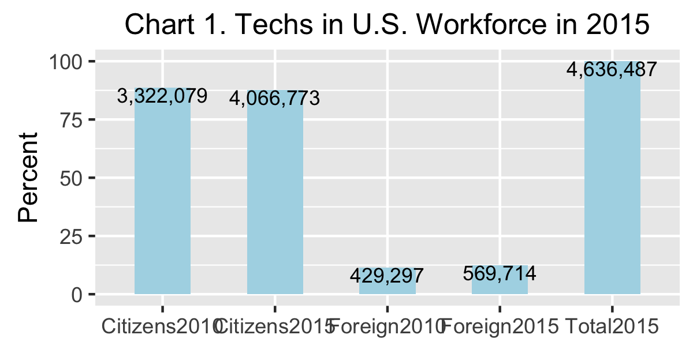
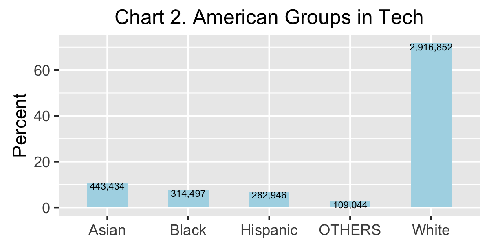
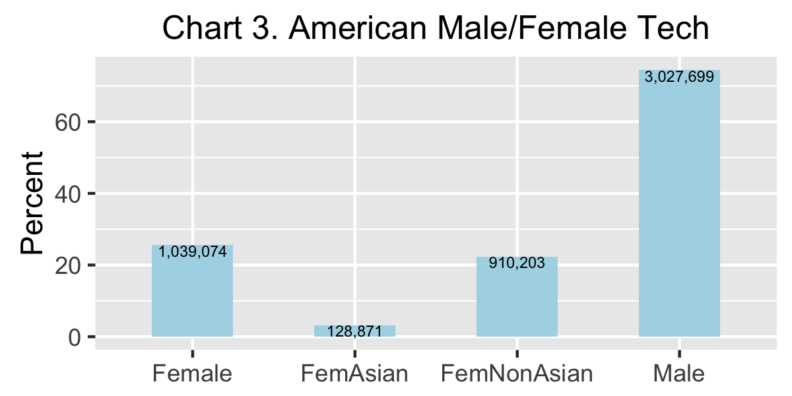
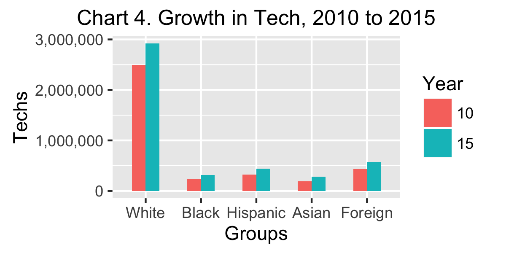

```{r LOAD, echo=FALSE, cache=FALSE}

    #### load("dfRaceWorkplaceAndShares.rda") ### Only use data in tables, plots, and maps
    load("dfCensus2.rda") 
    load("dfTab1A1B2A2B3ABCDEF.rda")
    load("dfTab4.rda")   
    load("dfMap4.rda")
    load("dfPlot5Tab5beta1000.rda")
    load("dfTab67A7B7C7D7E7F8A8B8C8D8E8F.rda")
    load("APPENDIX.rda")  
    
    ###install.packages("gridExtra")
    library(prettydoc)
    library(maps)    
    library(mapproj) ### needed by ggplot2, but not installed automaticallly
    library(ggplot2)
    library(gridExtra)
    ### library(printr)
    library(grid)
    library(gtable)
    library(grid)

    ### Intending to use Yihui Xie's printr package for better tables later
    ### install.packages("devtools")
    ### library(devtools)
    ### install_github("yihui/printr")
    ### library(printr)
    ### detach('package:printr', unload = TRUE)
    
tt3 <- ttheme_minimal(
  core=list(bg_params = list(fill = blues9[1:7], col=NA),
            fg_params=list(fontface=3)),
  colhead=list(fg_params=list(col="navyblue", fontface=4L)),
  rowhead=list(fg_params=list(col="orange", fontface=3L)))

fem10 <- round(dfTable3ZZ[1, "Tech10"] * dfTable3ZZ[1, "perF10"]/100, digits=0) ### calculate females in 2010 from female share
perFemIncrease <- round(100 * (dfTable3Z[1,"Fem"] - fem10)/fem10, digits=1)

```
\pagenumbering{arabic}   

## Overview   
<i>Please note that all of the numbers in this overview and in the subsequent report are estimates based on U.S. Census survey samples. So all numbers should be read as "approximately" even when the word "approximately" does not appear. </i>  

* In 2015 there were approximately `r prettyNum(dfTable1A["Num","Total"], big.mark=",", scientific=FALSE)` workers in the entire U.S. workforce. Approximately  `r prettyNum(dfTable1A["Num","Citizens"], big.mark=",", scientific=FALSE)` were American citizens; `r prettyNum(dfTable1A["Num","Foreign"], big.mark=",", scientific=FALSE)` were foreign workers who moved here to work for their employers.  (See Table 1A)

* In 2015, there were approximately `r prettyNum(dfTable1C["Num","Total2015"], big.mark=",", scientific=FALSE)` workers in the information technology sectors of the 50 states and the District of Columbia; `r prettyNum(dfTable1C["Num","Citizens2015"], big.mark=",", scientific=FALSE)` were Americans; `r prettyNum(dfTable1C["Num","Foreign2015"], big.mark=",", scientific=FALSE)`  were foreign tech professionals <i>.See Chart 1, below</i>

  
     
* In 2015 there were approximately `r prettyNum(dfTable1D["Num","White"], big.mark=",", scientific=FALSE)` White Americans in U.S. tech; `r prettyNum(dfTable1D["Num","Black"], big.mark=",", scientific=FALSE)` Black Americans; `r prettyNum(dfTable1D["Num","Hispanic"], big.mark=",", scientific=FALSE)` Hispanic Americans;  `r prettyNum(dfTable1D["Num","Asian"], big.mark=",", scientific=FALSE)` Asian Americans; and `r prettyNum(dfTable1D["Num","OTHERS"], big.mark=",", scientific=FALSE)` were from other racial/ethnic groups  <i>(See Chart 2, below.)</i>  



* Approximately `r prettyNum(dfTable2B["Num","Female"], big.mark=",", scientific=FALSE)` American techs were female; `r prettyNum(dfTable2B["Num","Male"], big.mark=",", scientific=FALSE)` were male.  Approximately `r prettyNum(dfTable2B["Num","FemAsian"], big.mark=",", scientific=FALSE)` American female techs were Asian-American; and  `r prettyNum(dfTable2B["Num","FemNonAsian"], big.mark=",", scientific=FALSE)` were non-Asian American. <i>(See Chart 3, below.)</i>



* If all other things were equal, one would expect that the percentage of a state's tech sector that was Black American would be about the same as the percentage of the state's total workforce that was Black American. One would expect similar parity for the percentages of Hispanic Americans and for American females. <br /><br />But all things were not equal. The percentage of the tech sector of most states that was American Black, Hispanic, or female was substantially smaller than the percentage of the state's total workforce that was American Black, Hispanic, or female. By contrast, the percentage of state tech sectors that was Asian American was usually greater than the Asian American percentage of the total workforce population in each state, ranging as high as `r dfTable6["Asian", "Max"]` times that percentage, (See Tables 4C and 6)  

* The subgroup of Asian American females occupied disproportionately larger shares of the tech sectors in most states. Indeed, their tech shares ranged as high as `r dfTable6["FemAsian", "Max"]` times their shares of state workforce populations. (See Table 6.) By contrast, the subgroup of non-Asian American females occupied much smaller shares of state tech sectors than their shares of state workforce populations. (See Table 6.)   

* The number of tech jobs held by Americans grew by `r prettyNum(dfTable3ZZ[1,"perCh"], big.mark=",", scientific=FALSE)` percent between 2010 and 2015, i.e., from  `r prettyNum(dfTable3ZZ[1,"Tech10"], big.mark=",", scientific=FALSE)` to  `r prettyNum(dfTable3ZZ[1,"Tech15"], big.mark=",", scientific=FALSE)`; the number tech jobs held by White Americans grew by `r prettyNum(dfTable3AA[1,"perCh"], big.mark=",", scientific=FALSE)` percent, i.e., from `r prettyNum(dfTable3AA[1,"Tech10"], big.mark=",", scientific=FALSE)` to `r prettyNum(dfTable3AA[1,"Tech15"], big.mark=",", scientific=FALSE)`; tech jobs held by Black Americans grew by `r prettyNum(dfTable3BB[1,"perCh"], big.mark=",", scientific=FALSE)` percent, i.e., from `r prettyNum(dfTable3BB[1,"Tech10"], big.mark=",", scientific=FALSE)` to `r prettyNum(dfTable3BB[1,"Tech15"], big.mark=",", scientific=FALSE)`; tech jobs held by Asian Americans grew by `r prettyNum(dfTable3CC[1,"perCh"], big.mark=",", scientific=FALSE)` percent, i.e., from `r prettyNum(dfTable3CC[1,"Tech10"], big.mark=",", scientific=FALSE)` to `r prettyNum(dfTable3CC[1,"Tech15"], big.mark=",", scientific=FALSE)`; and tech jobs held by Hispanic Americans grew by `r prettyNum(dfTable3DD[1,"perCh"], big.mark=",", scientific=FALSE)` percent, i.e., from `r prettyNum(dfTable3DD[1,"Tech10"], big.mark=",", scientific=FALSE)` to `r prettyNum(dfTable3DD[1,"Tech15"], big.mark=",", scientific=FALSE)`. <i>(See Chart 4, and Table3EE.)</i>

  

* The number of tech jobs held by American females grew by  `r perFemIncrease` percent between 2010 and 2015, i.e., from  `r prettyNum(fem10, big.mark=",", , scientific=FALSE)`, to `r prettyNum(dfTable3Z[1,"Fem"], big.mark=",", scientific=FALSE)`. However American females occupied a smaller percentage of the tech jobs held by American tech professionals in 2015 than they did in 2010, i.e., `r prettyNum(dfTable3ZZ[1,"perF10"], big.mark=",", scientific=FALSE)` percent in 2010 compared to only  `r prettyNum(dfTable3Z[1,"perF15"], big.mark=",", scientific=FALSE)` percent in 2015. (See Table 3Z and 3ZZ)

* The number of tech jobs held by foreign professionals in U.S. tech grew by  `r prettyNum(dfTable3EE[1,"Change"], big.mark=",", scientific=FALSE)` or `r prettyNum(dfTable3EE[1,"perCh"], big.mark=",", scientific=FALSE)` percent between 2010 and 2015, i.e., from  `r prettyNum(dfTable3EE[1,"Tech10"], big.mark=",", scientific=FALSE)` to `r prettyNum(dfTable3EE[1,"Tech15"], big.mark=",", scientific=FALSE)`. <i>(See Chart 4, above.)</i>

* The `r prettyNum(dfTable1E["Num","Asian"], big.mark=",", scientific=FALSE)` professionals imported from Asia in 2015 was substantially larger than the `r prettyNum(dfTable1D["Num","Black"], big.mark=",", scientific=FALSE)` Black American or the  `r prettyNum(dfTable1D["Num","Hispanic"], big.mark=",", scientific=FALSE)` Hispanic American professionals employed by U.S. tech in 2015. Indeed,  the `r prettyNum(dfTable1E[1,"Total"], big.mark=",", scientific=FALSE)` combined total of foreign professionals imported from Asia and from elsewhere in 2015 was almost as large as the  `r prettyNum((as.numeric(gsub(",", "",dfTable1D["Num","Black"])) + as.numeric(gsub(",", "", dfTable1D["Num","Hispanic"]))), big.mark=",", scientific=FALSE)` combined total of Black and Hispanic American professionals employed by U.S. tech.  (See Tables 1D and 1E.)

* The best states for Black American tech professionals were HBCU states: `r dfTable8B[1, 1]`, `r dfTable8B[2, 1]`, `r dfTable8B[3, 1]`, `r dfTable8B[4, 1]` and `r dfTable8B[5, 1]`. (See Table 8B)   

* The best states for Hispanic American tech professionals were `r dfTable8D[1, 1]`, `r dfTable8D[2, 1]`, `r dfTable8D[3, 1]`, and `r dfTable8D[4, 1]`. (See Table 8D)   

* The best states for Asian American tech professionals were `r dfTable8C[1, 1]`, `r dfTable8C[2, 1]`, `r dfTable8C[3, 1]`, `r dfTable8C[4, 1]`, and `r dfTable8C[5, 1]`. (See Table 8C)    

<small><i><center><a href="https://archimedes2kxx.github.io/BestStatesForBlackTech/Report-3.html" target="_self">back-to-top</a></center></i></small>   
  
<P style="page-break-before: always">  
## Findings
Brief answers to the first three sets of questions provide a broad statistical framwork for the extended responses to the fourth and fifth questions that form the core of this report. 

#### Question 1 -- How large was the total U.S. workforce and the U.S. tech sector in 2015?

<i>Question 1A</i> -- How many American workers were in the U.S. workforce in 2015? How many foreign workers? (<i>Note: the workforce contained persons 16 and over who held a job or were temporarily unemployed.</i>)

<i>Answer 1A</i> The answers to this question are shown in Table 1A (below). 

<i>Note that many of the tables in this section have the same format. The top row, labelled "Num" as an abbreviation for "Number", shows how many workers fall into the category of the heading of the column: American "Citizen", "Foreign" worker, and their combined "Total". The second row, labelled "Per" as short for "Percentage", shows the percentge of the "Total" for each of the numbers in the first row.</i>

<b>Table 1A -- American and Foreign Components of the U.S. Workforce in the 50 states plus the District of Columbia in 2015</b>
```{r, echo=FALSE, cache=FALSE, comment=NA}
   print(dfTable1A, quote=FALSE, row.names=TRUE)
```
     
 <small><i><center><a href="https://archimedes2kxx.github.io/BestStatesForBlackTech/Report-3.html" target="_self">back-to-top</a></center></i></small>      
 
<i>Question 1B</i> -- How large were the White, Black, Asian, and Hispanic American components of the  U.S. workforce in the 50 states plus the District of Columbia in 2015?       

<i>Answer 1B</i> ... In 2015, as shown in Table 1B (below), there were approximately `r prettyNum(dfTable1B["Num","Total"], big.mark=",", scientific=FALSE)` citizens in the workforce, a/k/a "labor force", in the 50 states plus DC. in 2015? The largest of the four racial/ethnic groups discussed in this report was White American (`r prettyNum(dfTable1B["Num","White"], big.mark=",", scientific=FALSE)`); the smallest was Asian American (`r prettyNum(dfTable1B["Num","Asian"], big.mark=",", scientific=FALSE)`). Hispanic American, the largest minority (`r prettyNum(dfTable1B["Num","Hispanic"], big.mark=",", scientific=FALSE)`), was larger than Black American (`r prettyNum(dfTable1B["Num","Black"], big.mark=",", scientific=FALSE)`).

<i>Note that the last column "OTHERS" includes workers who described themselves as members of another racial broup not included in the previous categories, or as biracial or multiracial. Also note that "White", "Black", and "Asian" include workers who described themselves as "White, but not Hispanic", "Black, but not Hispnic", and "Asian, but not Hispanic".</i>

<b>Table 1B -- American Racial/Ethnic Groups in the U.S. Workforce in the 50 states plus the District of Columbia in 2015 </b>
```{r, echo=FALSE, cache=FALSE, comment=NA}
   print(dfTable1B, row.names=TRUE, quote=FALSE)
```
      
<small><i><center><a href="https://archimedes2kxx.github.io/BestStatesForBlackTech/Report-3.html" target="_self">back-to-top</a></center></i></small>      
 
<i>Question 1C</i> -- How many U.S. citizens and how many foreign employees worked in the the tech sectors of the 50 states plus the District of Columbia  in 2015

<i>Answer 1C</i> ... Most of the tables in this report will deal with American techs or foreign techs, but not both. Therefore the counts in the second and third columns of this small table will recur in many subsequent tables.  

<b>Table 1C -- American and Foreign Components of the U.S. Tech Sector in 2015</b>    
```{r, echo=FALSE, cache=FALSE, comment=NA}
   print(dfTable1C, row.names=TRUE, quote=FALSE)
```
<small><i><center><a href="https://archimedes2kxx.github.io/BestStatesForBlackTech/Report-3.html" target="_self">back-to-top</a></center></i></small>      
 
<i>Question 1D</i> -- How many White, Black, Asian, and Hispanic Americans were in the U.S. tech sector of the 50 states plus the District of Columbia in 2015? 

<i>Answer 1D</i> ... As shown in Table 1B (below), there were approximately `r prettyNum(dfTable1D["Num","Total"], big.mark=",", scientific=FALSE)` American tech professionals in the U.S. in 2015.  White Americans were a substantial majority (`r prettyNum(dfTable1D["Num","White"], big.mark=",", scientific=FALSE)`) of the tech sector (`r prettyNum(dfTable1D["Per","White"], big.mark=",", scientific=FALSE)`%); Asians placed second (`r prettyNum(dfTable1D["Num","Asian"], big.mark=",", scientific=FALSE)`); Blacks showed third (`r prettyNum(dfTable1D["Num","Black"], big.mark=",", scientific=FALSE)`); and Hispanic Americans came in fourth  (`r prettyNum(dfTable1D["Num","Hispanic"], big.mark=",", scientific=FALSE)`)

<b>Table 1D -- American Racial/Ethnic Groups in the U.S. Tech Sector in 2015</b>   
```{r, echo=FALSE, cache=FALSE, comment=NA}
    print(dfTable1D, row.names=TRUE, quote=FALSE)
```
  
<small><i><center><a href="https://archimedes2kxx.github.io/BestStatesForBlackTech/Report-3.html" target="_self">back-to-top</a></center></i></small>      

<i>Question 1E</i> -- How many Asian and non-Asian foreign employees were in U.S. tech in the 50 states plus the District of Columbia in 2015? 

<i>Answer 1E</i> ...  The total number of tech workers imported from Asia and from countries outside of Asia shown in Table 1E (below) will recur in subsequent tables.
  
<b>Table 1E -- Foreign Asian and Non-Asian Components of the U.S. Tech Sector in 2015</b> 
```{r, echo=FALSE, cache=FALSE, comment=NA}
   print(dfTable1E, row.names=TRUE, quote = FALSE)
```
<small><i><center><a href="https://archimedes2kxx.github.io/BestStatesForBlackTech/Report-3.html" target="_self">back-to-top</a></center></i></small>   

<P style="page-break-before: always">   
#### Question 2 -- What was the American male/female composition of U.S. workforce and tech sector in 2015?

<i>Question 2A</i> -- What was the American male/female composition of the U.S. workforce in the 50 states plus the District of Columbia in 2015?

<i>Answer 2A</i> ... As shown in Table 2A (below), the U.S. workforce was close to an even split between males and females. But given the focus of this report, the table also breaks the female half into a small Asian  component (`r dfTable2A["Per", "FemAsian"]` percent) and a much larger non-Asian female component (`r dfTable2A["Per", "FemNonAsian"]` percent)

<b>Table 2A -- American Male/Female Composition of the U.S. Workforce in 2015</b>   
```{r, echo=FALSE, cache=FALSE, comment=NA}
  print(format(dfTable2A, big.mark=","), row.names=TRUE, quote=FALSE)
```

<i>Question 2B</i> -- What was the American male/female composition of the tech sector in the 50 states plus the District of Columbia in 2015?

Answer 2B ... As shown in Table 2B (below), the ratio of American male to American female techs was about  `r round(as.numeric(dfTable2B["Per", "Male"])/as.numeric(dfTable2B["Per", "Female"]), digits=0)` to 1, more specifically `r dfTable2B["Per", "Male"]` percent to `r dfTable2B["Per", "Female"]` percent. The ratio of Non-Asian American females to Asian American females was about `r round(as.numeric(dfTable2B["Per", "FemNonAsian"])/as.numeric(dfTable2B["Per", "FemAsian"]), digits=0)` to 1, i.e., `r dfTable2B["Per", "FemNonAsian"]` percent to `r dfTable2B["Per", "FemAsian"]` percent.

<b>Table 2B -- American Male/fFemale Composition of the U.S. Tech Sector in 2015</b>   
```{r, echo=FALSE, cache=FALSE, comment=NA}
  print(format(dfTable2B, big.mark=","), row.names=TRUE, quote=FALSE)
```

<small><i><center><a href="https://archimedes2kxx.github.io/BestStatesForBlackTech/Report-3.html" target="_self">back-to-top</a></center></i></small>       

<P style="page-break-before: always">    
#### Question 3 -- How did the racial, ethnic, foreign, and male/female shares of jobs in U.S. tech change between 2010 and 2015?  

The six pairs of tables in this section display profiles of the various groups considered in this report. 

For the purposes of this report, "information technology" was defined as the thirteen standard occupation categories (SOC) that appear in the first column of the following tables. Twelve related to software, e.g., Software Developers and Computer Programmers; one related to hardware, i.e., Computer Hardware Engineers.     

The first column of each table contains a list of job categories. Some categories were abbreviated to enable the rows of the table to be short enough to appear on the same line. Abbreviations include "Comp" for "Computer"; "Info" for "Information"; and "Net" for "Network". Column headings were also abbreviated as follows:   

* <b>Tech10</b> ... the number of tech workers in each job category in 2010   

* <b>Tech15</b> ... the number of tech workers in each job category in 2015   

* <b>perTS</b> ... the "Percentage of Tech Share", which shows the percentage of the total number of American tech workers that were employed in each job category in the 50 states plus the District of Columbia. For example, in Table 3Z (below) the `r prettyNum(dfTable3Z["SOFTWARE DEVELOPERS", "Tech15"], big.mark=",", scientific=FALSE)` workers in "Software Development" represented `r prettyNum(dfTable3Z["SOFTWARE DEVELOPERS", "perTS"], big.mark=",", scientific=FALSE)` percent of the `r prettyNum(dfTable3Z["All Occupations", "Tech15"], big.mark=",", scientific=FALSE)` total American tech workers in 2015. The `r prettyNum(dfTable3Z["COMP PROGRAMMERS", "Tech15"], big.mark=",", scientific=FALSE)` workers "Computer Programmers" were `r prettyNum(dfTable3Z["COMP PROGRAMMERS", "perTS"], big.mark=",", scientific=FALSE)` percent of the total `r prettyNum(dfTable3Z["All Occupations", "Tech15"], big.mark=",", scientific=FALSE)`.   

* <b>Fem</b> ... the number of "Female" tech workers". The number of males can be calculated by substracting the female workers from the total number of workers in each category. For example, in Table 3Z (below) there were `r prettyNum(dfTable3Z["SOFTWARE DEVELOPERS", "Tech15"], big.mark=",", scientific=FALSE)` American software developers in the 50 states plus DC in 2015 of which `r prettyNum(dfTable3Z["SOFTWARE DEVELOPERS", "Fem"], big.mark=",", scientific=FALSE)` were female. So the number of male software developers was `r prettyNum(dfTable3Z["SOFTWARE DEVELOPERS", "Tech15"], big.mark=",", scientific=FALSE)` - `r prettyNum(dfTable3Z["SOFTWARE DEVELOPERS", "Fem"], big.mark=",", scientific=FALSE)` = `r prettyNum((dfTable3Z["SOFTWARE DEVELOPERS", "Tech15"] - dfTable3Z["SOFTWARE DEVELOPERS", "Fem"]), big.mark=",", scientific=FALSE)`. 

* <b>perF15</b> ... the "Percent Female in 2015" displays the percent of jobs in each category that were held by female techs in 2015. For example, Table 3Z shows that the `r prettyNum(dfTable3Z["SOFTWARE DEVELOPERS", "Fem"], big.mark=",", scientific=FALSE)` female software developers were `r prettyNum(dfTable3Z["SOFTWARE DEVELOPERS", "perF15"], big.mark=",", scientific=FALSE)` percent of the total `r prettyNum(dfTable3Z["SOFTWARE DEVELOPERS", "Tech15"], big.mark=",", scientific=FALSE)`

* <b>perF10</b> ... the "Percent Female in 2010" displays the percent of jobs in each category that were held by female techs in 2010. This stat is always contained in the companion table, e.g., Table 3ZZ.

* <b>Change</b> ... the difference between the number of workers in each job category in 2010 and the number in 2015. This stat is always found in the companion table, e.g., Table 3ZZ. 

* <b>perCh</b> ... the change from 2010 to 2015 as a percentage of the jobs in 2010.  

<i>Question 3.0</i> -- How many American male vs. female techs were in each category in 2010 and 2015 in the 50 states and the District of Columbia?

 <i>Answer 3.0</i> ... As per its title, Tables 3Z and 3ZZ (below) only contain data about tech workers who were American citizens; data about foreign workers will appear in Tables 3E and 3EE. An important statistic that can be derived from the data in Table 3ZZ is that `r prettyNum(  round(dfTable3ZZ[1, "Tech10"] * dfTable3ZZ[1, "perF10"]/100,digits=0)  , big.mark=",", scientific=FALSE)` techs in 2010 were female, i.e., `r prettyNum(dfTable3ZZ[1, "perF10"], big.mark=",", scientific=FALSE) ` percent of `r prettyNum(dfTable3ZZ[1, "Tech10"], big.mark=",", scientific=FALSE)`.
 
 <b>Table 3Z -- American Male/Female Composition of U.S. Tech in 2015</b> 
```{r, echo=FALSE, cache=FALSE, comment=NA}
   print(format(dfTable3Z, big.mark=","), row.names=FALSE, quote=FALSE)
```

<P style="page-break-before: always">    
 <b>Table 3ZZ -- Changes in the American Composition of U.S. Tech Between 2010 and 2015</b> 
```{r, echo=FALSE, cache=FALSE, comment=NA}
   print(format(dfTable3ZZ, big.mark=","), row.names=FALSE, quote=FALSE)
```
<small><i><center><a href="https://archimedes2kxx.github.io/BestStatesForBlackTech/Report-3.html" target="_self">back-to-top</a></center></i></small>  

<i>Question 3A</i> -- How many White American male vs. female techs were in each category in 2010 and 2015 in the 50 states and the District of Columbia?

 <i>Answer 3A</i> ... Data for White American techs in 2015 is in Table 3A; data that compares 2010 to 2015 is in Table 3AA.

<P style="page-break-before: always">     
 <b>Table 3A -- White American Male/Female Composition of U.S. Tech in 2015</b> 
```{r, echo=FALSE, cache=FALSE, comment=NA}
   print(format(dfTable3A, big.mark=","), row.names=FALSE, quote=FALSE)
```

<b>Table 3AA -- Changes in the White American Composition of U.S. Tech Between 2010 and 2015</b> 
```{r, echo=FALSE, cache=FALSE, comment=NA}
   print(format(dfTable3AA, big.mark=","), row.names=FALSE, quote=FALSE)
```
<small><i><center><a href="https://archimedes2kxx.github.io/BestStatesForBlackTech/Report-3.html" target="_self">back-to-top</a></center></i></small>  

<P style="page-break-before: always">    
<i>Question 3B</i> -- How many Black American male vs. female techs were in each category in 2010 and 2015 in the 50 states and the District of Columbia?  

 <i>Answer 3B</i> ... Data for Black American techs in 2015 is in Table 3B; data that compares 2010 to 2015 is in Table 3BB.

 <b>Table 3B -- Black American Male/Female Composition of U.S. Tech in 2015</b> 
```{r, echo=FALSE, cache=FALSE, comment=NA}
   print(format(dfTable3B, big.mark=","), row.names=FALSE, quote=FALSE)
```

<P style="page-break-before: always">    
 <b>Table 3BB -- Changes in the Black American Composition of U.S. Tech Between 2010 and 2015</b> 
```{r, echo=FALSE, cache=FALSE, comment=NA}
   print(format(dfTable3BB, big.mark=","), row.names=FALSE, quote=FALSE)
```
<small><i><center><a href="https://archimedes2kxx.github.io/BestStatesForBlackTech/Report-3.html" target="_self">back-to-top</a></center></i></small>  

<i>Question 3C</i> -- How many Hispanic American male vs. female techs were in each category in 2010 and 2015 in the 50 states and the District of Columbia?

 <i>Answer 3C</i> ... Data for Hispanic American techs in 2015 is in Table 3C; data that compares 2010 to 2015 is in Table 3CC.

<P style="page-break-before: always">    
 <b>Table 3C -- Asian American Male/Female Composition of U.S. Tech in 2015</b> 
```{r, echo=FALSE, cache=FALSE, comment=NA}
   print(format(dfTable3C, big.mark=","), row.names=FALSE, quote=FALSE)
```

 <b>Table 3CC -- Changes in the Asian American Composition of U.S. Tech Between 2010 and 2015</b> 
```{r, echo=FALSE, cache=FALSE, comment=NA}
   print(format(dfTable3CC, big.mark=","), row.names=FALSE, quote=FALSE)
```
<small><i><center><a href="https://archimedes2kxx.github.io/BestStatesForBlackTech/Report-3.html" target="_self">back-to-top</a></center></i></small>  

<P style="page-break-before: always">    
<i>Question 3D</i> -- How many Hispanic American male vs. female techs were in each category in 2010 and 2015 in the 50 states and the District of Columbia?   

 <i>Answer 3D</i> ... Data for Hispanic American techs in 2015 is in Table 3D; data that compares 2010 to 2015 is in Table 3DD.

 <b>Table 3D -- Hispanic American Male/Female Composition of U.S. Tech in 2015</b> 
```{r, echo=FALSE, cache=FALSE, comment=NA}
   print(format(dfTable3D, big.mark=","), row.names=FALSE, quote=FALSE)
```

<P style="page-break-before: always">    
 <b>Table 3DD -- Changes in the Hispanic American Composition of U.S. Tech Between 2010 and 2015</b> 
```{r, echo=FALSE, cache=FALSE, comment=NA}
   print(format(dfTable3DD, big.mark=","), row.names=FALSE, quote=FALSE)
```
<small><i><center><a href="https://archimedes2kxx.github.io/BestStatesForBlackTech/Report-3.html" target="_self">back-to-top</a></center></i></small>  
  
<P style="page-break-before: always">    
<i>Question 3E</i> -- How many foreign male vs. female techs were in each category in 2010 and 2015 in the 50 states and the District of Columbia?   

 <i>Answer 3E</i> ... Data for foreign techs in 2015 is in Table 3E; data that compares 2010 to 2015 is in Table 3EE.

 <b>Table 3E -- Foreign Male/Female Composition of U.S. Tech in 2015</b> 
```{r, echo=FALSE, cache=FALSE, comment=NA}
   print(format(dfTable3E, big.mark=","), row.names=FALSE, quote=FALSE)
```

<P style="page-break-before: always">    
 <b>Table 3EE -- Changes in the Foreign Composition of U.S. Tech Between 2010 and 2015</b> 
```{r, echo=FALSE, cache=FALSE, comment=NA}
   print(format(dfTable3EE, big.mark=","), row.names=FALSE, quote=FALSE)
```
<small><i><center><a href="https://archimedes2kxx.github.io/BestStatesForBlackTech/Report-3.html" target="_self">back-to-top</a></center></i></small>    
  
<P style="page-break-before: always">    
#### Question 4 -- Where did American tech professionals work in 2015?      
Answer 4 ... The following sections provide an extensive response to a more specific formulation of this question ==> In which states did American tech professionals work in 2015?  

Table 4 (below) lists the six states that employed the most American techs in 2015. These states will also appear in just about every table that follows because  they employed such a large share (`r prettyNum(dfTable4[1, "perTop6"])` percent) of the `r prettyNum(dfTable4[1, "ALL STATES"], big.mark=",", scientific=FALSE)` American techs in the U.S.

<b>Table 4 ... Biggest Half-Dozen Tech States in 2015</b>
```{r, echo=FALSE, cache=FALSE, comment=NA}
colnames(dfTable4) <- c("ALL STATES", "CA", "TX", "NY", "FL", "VA", "IL", "Total", "perT6")
### rownames(dfTable4) <- ""
### 1-row table is too long to print on one row, so totals in drop col 8 and use state abbreviations
print(format(dfTable4[,c(1:7,9)], big.mark = "," , rownames=FALSE ))
```
 
I've presented U.S. Census data that shows the geographic distribution of tech professionals in two formats: (1) as a set of choropleth maps and (2) as a corresponding set of tables. I have shown the maps first because it's easier to see the workplace patterns of the racial/ethnic/female groups by looking at multicolored maps than by scanning columns of data in long tables. Indeed, a quick scan of the maps makes it easier to spot the same patterns in the data tables.

There are six maps (below), one for each racial/ethnic group plus two female groups, Asian American females and non-Asian American females. Map 4A shows the workplace distribution of White techs; Map 4B shows the distribution of Black techs; Map 4C shows Asian techs; Map 4D shows Hispanic; Map E shows Asian female; Map F shows non-Asian females. Each map colors the states with the largest number of tech workers in the darkest colors, and colors the states with the least tech workers in the lightest colors. The same colors represent the same percentages on all eight maps
   

<P style="page-break-before: always">    
<b> Maps 4A (Whites), 4B (Blacks), 4C (Asians), 4D (Hispanics), 4E (Asian Females), and 4F (Non-Asian Females)</b> ... <em>Lower 48 and DC</em>


```{r, echo=FALSE, cache=FALSE, comment=NA}
    grid.arrange(dfMap4A, dfMap4B, dfMap4C, dfMap4D, dfMap4E, dfMap4F, ncol=2) 
```

* Map 4A displays light hues for all states, indicating that White American techs were spread across a large number of states, with California and Texas having concentrations below 10 percent but only  marginally higher percentages than the other states. Note that the legend for Map 4A only contains three color blocks; the fourth gray "zero" block is missing because the Census sample indicated that none of the 50 states nor Washington, DC contained zero White American techs. Four legend blocks appear for each of the other five maps because the Census sample contained too few American techs to provide a reliable estimate of the actual number of techs in one or more states. The tables in this section assigned zero values to those states. The few zero states will be the lightest of the gray states, but will be difficult to identify on the maps. The reader is referred to the tables.

* Map 4B shows that most Black American techs were located in the Eastern and Southern states, with the largest number working in Georgia, second in Texas, and third in Virginia

* Map 4C shows that Asian American techs were highly concentrated in California where their concentration was higher than any other group in any state. Otherwise Asians were spread out over other states with much smaller numbers Asian American professionals.   

* Map 4D shows that Hispanic American techs were concentrated in California, Texas, and Florida   

* Map 4E shows that Asian American female techs were highly concentrated in California.

* Map 4F shows that non-Asian American female techs had their largest shares of tech in California, Texas, and Florida, but the distribution was more dispersed than the distribution for Asian female techs.   

<small><i><center><a href="https://archimedes2kxx.github.io/BestStatesForBlackTech/Report-3.html" target="_self">back-to-top</a></center></i></small>
    

<p style="page-break-before: always">        
<b>Tables 4A, 4B, 4C, 4D, 4E, 4F</b> ... <i>50 states plus DC</i>  
Six data tables impose numeric precision on the qualitative insights provided by the corresponding maps. The tables are ordered by the number of techs from each group that worked in each state. The short versions that only contain the top ten rows are displayed below. To view the full tables that contain data for all 50 states plus the District of Columbia, please click the link below the table name. Each table (full and short versions) has the following eight columns:<br /><br />
1. <b>State</b> -- State of workplace for the American techs whose data is shown in the other columns of each row<br /> <br />
2. <b>AllTech</b> -- Data for all of American techs in the U.S. The data in this column is repeated in each of the six tables, but the order of the rows differs from one table to the next. For example Table 4A shows that the total number of techs in California in 2015 was `r prettyNum(dfTable4A["California", "TotalTech"], big.mark=",", scientific=FALSE)`, and the total number in Texas was   `r prettyNum(dfTable4A["Texas", "TotalTech"], big.mark=",", scientific=FALSE)` <br /> <br />
3. <b>perSS</b> -- The state's share of each group's national total. More specifically, the percent of all American techs in a group that worked in each state. For example, Table 4A shows that  `r dfTable4A["California", "perState"]`  percent of all White techs worked in California in 2015, and `r dfTable4A["Texas", "perState"]`  percent worked in Texas.<br /> <br />
4. <b>WhiTech, BlkTech, AsiTech, HispTech, FemAsiTech, or FemNonAsTech</b> -- White techs, Black techs, Asian techs, Hispanic techs, Asian female techs, and Non-Asian female techs in tables A, B, C, D, E, and F, respectively. The data in this column shows the number of techs from the table's group that worked in each state. For example, Table 4A shows that `r prettyNum(dfTable4A["California", "WhiteTech"], big.mark=",", scientific=FALSE)` White techs worked in California, and `r prettyNum(dfTable4A["Texas", "WhiteTech"], big.mark=",", scientific=FALSE)` White techs worked in Texas. <b>The rows of each table are ordered by data in this column, i.e., by the number of techs in each state; states with higher numbers are at the top of the table; states with lower numbers are at the bottom.</b><br /> <br />
5. <b>perT</b> -- Percent of a state's techs who were in the table's group. For exampleTable 4A shows that `r dfTable4A["California", "perWhiteTech"]`  percent of the techs in California were White, and `r dfTable4A["Texas", "perWhiteTech"]`  percent of the techs in Texas were White.<br /> <br />
6. <b>WhiPop, BlkPop, AsiPop, HspPop, FemAsiPop, or FemNonAsiPop</b> -- White, Black, Asian, Hispanic, female Asian, or female non-Asian components of the workforce in each state. For example, Table 4A shows that the White component of the California workforce in 2015 was `r prettyNum(dfTable4A["California", "WhitePop"], big.mark=",", scientific=FALSE)`, and the White component of the Texas workforce was `r prettyNum(dfTable4A["Texas", "WhitePop"], big.mark=",", scientific=FALSE)`.<br /><br />
7. <b>perP</b> -- Percent of the state's total workforce that belonged to the table's group. For example, Table 4A shows that in 2015, `r dfTable4A["California", "perWhitePop"]` percent of the total workforce of California was White, and `r dfTable4A["Texas", "perWhitePop"]` percent of the total workforce of Texas was white<br />.<br />
8. <b>Par</b> -- Parity = The ratio of the  percent of the state's tech workforce that belonged to the table's group divided by the percent of the state's total workforce that belonged to that group, i.e., perT / perP. For example, Table 4A shows that the White parity ratio for California was  `r dfTable4A["California", "Parity"]`, which is `r dfTable4A["California", "perWhiteTech"]`% divided by `r dfTable4A["California", "perWhitePop"]`%<br /><br />

<b>Table 4A -- White American Professionals in U.S. Information Technology -- Top 10 States </b>   
<i>[Click here for full version](Table4A-Full-White-Employment.html)</i>
```{r, echo=FALSE, cache=FALSE, comment=NA}
    ### Change of column names is permanent from here on ... matches displayed colum names
    colnames(dfTable4A) <- c("State", "AllTech", "perSS", "WhiTech", "perT", "WhiPop", "perP", "Par")
print(format(dfTable4A[1:11,], big.mark = ","), row.names=FALSE)  

```

<P style="page-break-before: always">    
<b>Comments about Table 4A -- White American Professionals in Tech</b>   

* The numbers in the third (perSS) and fourth (WhiTech) columns of this table, i.e., the percentage of the nation's White techs who worked in each state and the estimated number of techs (WhiTech) in each state are equivalent to the colors on Map 4A. Indeed, the colors on this map are based on the numbers in these columns.   

* To be specific, the third and fourth columns show that in 2015 the largest number of White techs worked in California; the next largest worked in Texas. White techs were found in every state after that in smaller and smaller numbers.   

* This story is captured by the parity values in the last column (Par) of Table 4A (and in its full version). White parity values were all close to 1.0. Therefore the percentage of techs who were White in each state was more or less the same as the percentage of Whites in the state's total workforce. In other words, if you walked into a tech office in any state in the USA, you would probably encounter the same percentage of White techs as the percentage of White people you would encounter walking down the street in that state -- with an important caveat:  random encounters with 10 White people on a street would only involve five males; but as per Table 3 (above), random encounters with 10 White techs in an office would probably involve seven or eight males.
<small><i><center><a href="https://archimedes2kxx.github.io/BestStatesForBlackTech/Report-3.html" target="_self">back-to-top</a></center></i></small>  

<P style="page-break-before: always">    
<b>Table 4B --  Black American Professionals in U.S. Information Technology -- Top 10 states</b>    
<i>[Click here for full version](Table4B-Full-Black-Employment.html)</i> 
```{r, echo=FALSE, cache=FALSE, comment=NA}
    colnames(dfTable4B) <- c("State", "AllTech", "perSS", "BlkTech", "perT", "BlkPop", "perP", "Par")  
    print(format(dfTable4B[1:11,], big.mark = ","), row.names=FALSE)  
```
<b>Comments about Table 4B -- Black American Professionals in Tech</b>   

* Although most tech professionals worked in the same states in which they lived, New York City and Washington, DC had large daytime commuter populations. Many techs lived in Maryland and Virginia, but worked in DC;  and many who lived in New Jersey and Connecticut worked in New York. There were also substantial commuter flows in the opposite directions, i.e., techs who lived in the core cities but worked in the adjacent states.

* Column 4 (BlkTech) of Table 4B (above) shows that in 2015 the largest number of Black techs worked in Texas, second largest in Georgia, third in Virginia, fourth in Maryland, and fifth in California. Why? Because in 2015 the vast majority Black Americans still lived in Eastern and Southern states; so that's where most of the Black techs were found. This put most Black techs at a considerable disadvantage with regards to learning about and/or being recruited for tech jobs in Silicon Valley.

<small><i><center><a href="https://archimedes2kxx.github.io/BestStatesForBlackTech/Report-3.html" target="_self">back-to-top</a></center></i></small> 

<P style="page-break-before: always">    
<b>Table 4C --  Asian American Professionals in U.S. Information Technology -- Top 10 states</b>    
<i>[Click here for full version](Table4C-Full-Asian-Employment.html)</i>

```{r, echo=FALSE, cache=FALSE, comment=NA}
    colnames(dfTable4C) <- c("State", "AllTech", "perSS",  "AsiTech", "perT", "AsiPop", "perP", "Par")
    print(format(dfTable4C[1:11,], big.mark = ","), row.names=FALSE)  
```
<b>Comments about Table 4C -- Asian American Professionals in Tech</b>    

* As per the second row in the fourth column in Table 4C, California was home to `r prettyNum(dfTable4C["California", "AsiTech"], big.mark=",", scientific=FALSE)` Asian techs, which represented `r dfTable4C["California", "perSS"]` percent of all of the Asian techs in the U.S. This was, by far, the highest concentration of any racial/ethnic group in any state. Asian techs also obtained `r dfTable4C["California", "perT"]` percent of the `r prettyNum(dfTable4C["California", "AllTech"], big.mark=",", scientific=FALSE)` tech jobs in California, the largest share of the tech sector in any state. (See the <i>[full version](Table4C-Full-Asian-Employment.html)</i> of Tablc 4C)

* Although the intensity of Asian invovement in the tech sector of California was impressive, Asian participation in the tech sector of every other state was also remarkable. The parity values in the last column of the table provide concise summaries. The <i>[full version](Table4C-Full-Asian-Employment.html)</i> of Table 4C shows that Asian parity values  ranged from `r dfTable6["Asian", "Min"]` to `r dfTable6["Asian", "Max"]`. In other words, the Asian share of the tech sectors in the 50 states plus DC ranged from `r dfTable6["Asian", "Min"]` times their share of the state's total workforce to `r dfTable6["Asian", "Max"]` times their share of the state's total workforce.   

<small><i><center><a href="https://archimedes2kxx.github.io/BestStatesForBlackTech/Report-3.html" target="_self">back-to-top</a></center></i></small> 

<P style="page-break-before: always">    
<b>Table 4D --  Hispanic American Professionals in U.S. Information Technology -- Top 10 states</b>      
 <i>[Click here for full version](Table4D-Full-Hispanic-Employment.html)</i> 

```{r, echo=FALSE, cache=FALSE, comment=NA}
    colnames(dfTable4D) <- c("State", "AllTech", "perSS", "HspTech", "perT", "HspPop", "perP", "Par")
    print(format(dfTable4D[1:11,], big.mark=","), row.names=FALSE)  
```
<b>Comments about Table 4D -- Hispanic American Professionals in Tech</b>  

* As per the third column (perSS) of Table 4D, Hispanic techs were concentrated in three states: California, Texas, and Florida. The table shows that `r dfTable4D["California", "perSS"]` percent worked in California, `r dfTable4D["Texas", "perSS"]` percent worked in Texas, and `r dfTable4D["Florida", "perSS"]` percent worked in Florida. Taken together, these three states accounted for `r dfTable4D["California", "perSS"] + dfTable4D["Texas", "perSS"] + dfTable4D["Florida", "perSS"] ` percent of the Hispanic techs in the entire country, i.e., about half. The other half work in the other 47 states and the District of Columbia.  

* All of the parity values of the top 10 states for Black Ameican techs shown in the last column of Table 4B are substantially higher than the parity values for all of the top 10 states for Hispanic techs shown in Table 4D ... with one exception: Florida, parity = `r dfTable4D["Florida", "Par"]`. Florida's parity value for Hispanic techs was more than twice the `r dfTable4D["California", "Par"]` parity value for Hispanics in California. Indeed, Table 4D shows that California had the lowest parity value of all of the top ten states for Hispanics. These considerations suggests that Hispanic techs may have encountered larger employment barriers than Black techs, especially in California.   

* Despite California's relatively low Hispanic American parity, the fifth column (perT) of Table 4D shows that `r dfTable4D["California", "perT"]` percent of the techs who worked in California were Hispanic. This figure is remarkable because it is two to three times as high as the 2 percent to 4 percent employment rates for Hispanic techs that have been reported by Silicon Valley's biggest firms in the last three years. It suggests that willingness to hire Hispanic techs was low throughout the state, but substantantially lower in the Valley.    

* Perhaps the Valley required higher academic qualifications than other employers. But as I pointed out in a recent note on this blog (<i><b>["The California Pipelines of Silicon Valley"](http://hbcu-levers.blogspot.com/2016/07/the-california-pipelines-of-silicon.html)</b></i>), IPEDS data showed that 20 percent of the combined total of White, Black, Asian, and Hispanic students enrolled in the best colleges and universities in California were Hispanic. So there is reason to be skeptical about claims that few Hispanic techs met the Valley's higher recruiting standards. 

<small><i><center><a href="https://archimedes2kxx.github.io/BestStatesForBlackTech/Report-3.html" target="_self">back-to-top</a></center></i></small> 

<b>Table 4E --  Asian American Females in U.S. Information Technology -- Top 10 states</b>     
 <i>[Click here for full version](Table4E-Full-Female-Asian-Employment.html)</i> 

```{r, echo=FALSE, cache=FALSE, comment=NA}
    colnames(dfTable4E) <- c("State", "AllTech", "perSS", "AsFemTech", "perT", "AsFemPop", "perP", "Par")
    print(format(dfTable4E[1:11,], big.mark=","), row.names=FALSE)  
```

<P style="page-break-before: always">    
<b>Table 4F --  Non-Asian American Females in U.S. Information Technology -- Top 10 states</b>    
 <i>[Click here for full version](Table4F-Full-Female-Non-Asian-Employment.html)</i> 

```{r, echo=FALSE, cache=FALSE, comment=NA}
    colnames(dfTable4F) <- c("State", "AllTech", "perSS", "NonAsFTech", "perT", "NonAsFPop", "perP", "Par")
    print(format(dfTable4F[1:11,], big.mark=","), row.names=FALSE)  
```
<b>Comments about Tables 4E and 4F</b>    
 
 * By comparing the California row of the third columns (perSS) of Tables 4C and 4E, the reader will see that that Asian Americanfemale tech professionals were as highly concentrated in California as the entire male and female Asian American cohort. To be specific, `r dfTable4E["California", "perSS"]` percent of all Asian American female techs in the U.S. were in California (Table 4E), which is essentially the same as the `r dfTable4C["California", "perSS"]` percent of all Asian American tech professionals who were in California (Table 4C).
 
 * Non-Asian American females showed no such concentration in California or in any other state. To be sure, California employed the most non-Asian female techs (`r dfTable4F["California", "perSS"]` %), but this was not much larger than the percentage in Texas (`r dfTable4F["Texas", "perSS"]` %), which was not much larger than in New York (`r dfTable4F["New York", "perSS"]` %), etc. 
 
 * The most striking differences between the distributions of Asian American and non-Asian American female techs were found in the parity values shown in the last columns of these tables. The parity values for non-Asian American female techs were substantially lower than the parity values for Asian American female techs. To be specific, Table 4F (full version) shows that all `r sum(dfTable4F$Par[-1] < 0.9)` states plus DC had parity values less than 0.9 for non-Asian female techs; and `r sum(dfTable4F$Par[-1] < 0.5)` had values less than 0.5. By contrast, Table 4E (full version) shows that `r sum(dfTable4E$Par[-1] > 1.2)` states plus DC had Asian female parity values greater than 1.1 ...  `r sum(dfTable4E$Par[-1] > 1.5)` had Asian female parity values greater than 1.5 ... and  `r sum(dfTable4E$Par[-1] > 2.5)` had Asian female parity values greater than 2.5
   
<small><i><center><a href="https://archimedes2kxx.github.io/BestStatesForBlackTech/Report-3.html" target="_self">back-to-top</a></center></i></small> 

<P style="page-break-before: always">  
### Question 5 -- Was the size of an American racial/ethnic group's share of a state's workforce related to its share of the tech jobs in that state? 

Answer 5: As shown in six plots that follow, there was a positive relationship, but the relationship was strongest for Asians, weaker for Asian American females, still weaker for Whites, weaker for Black American, weaker for non-Asian American females, and weakest for Hispanic Americans.

<b>Plots 5 -- Plots of American Tech Employment vs Race/Ethnic/Female Group Workforce</b>   
```{r, echo=FALSE, cache=FALSE, warning=FALSE}
    grid.arrange(ggPlotWhite, ggPlotBlack, ggPlotAsian, ggPlotHispanic, ggPlotFemAsian, ggPlotFemNonAsian, ncol=2)
```
    
<P style="page-break-before: always">  
<b>Comments about Plots 5A, 5B, 5C, 5D, 5E, 5F</b> 

* The total workforce of each state was at least 1,000 times the population of the techs in any racial/ethnic group. This suggested simple regressions of techs in a group against the total workforce of that group divided by 1000 in all 50 states plus Washington, DC. The slopes of the regression lines provided estimates of the number of additional techs that would be found in a state if the size of the group's total workforce population increased by 1000. 

* The regression lines and scatterplots of the <tech, workforce> data points appear in the six panels. The values of the slopes, called "beta1000", are displayed in the upper left corner of each plot. 

* As per the values of the beta1000 slopes, If each ethnic/racial group's workforce population increased by 1,000, Asian techs would increase by `r beta1000["Asian"]`; White Americans techs would increase by `r beta1000["White"]`, Black Americans would increase by `r beta1000["Black"]`; and Hispanic Americans would increase by `r beta1000["Hispanic"]`. The Asian Americann line had the steepest slope; the Hispanic American line had the flattest slope. The Asian American female slope, beta1000 = `r beta1000["FemAsian"]`, was almost as steep as the White American slope; non-Asian American female techs had the second flattest slope, beta1000 = `r beta1000["FemNonAsian"]`.

* This kind of simple regression implicitly assumes that the 50 states and DC were all more or less equally receptive or resistant to including more techs from the same groups. This may indeed have been true for most states. However, Table 4B shows that the Black American parity for Texas = `r dfTable4B["Texas", "Par"]`, whereas the Black parity for California = `r dfTable4B["California", "Par"]`. This suggests that Texas was more receptive to Black techs than California. And Table 4D shows that the Hispanic parity for Florida = `r dfTable4D["Florida", "Par"]`, while the Hispanic parity  for California = `r dfTable4D["California", "Par"]`. This suggests that Florida was more receptive to Hispanic techs than California.   

<small><i><center><a href="https://archimedes2kxx.github.io/BestStatesForBlackTech/Report-3.html" target="_self">back-to-top</a></center></i></small> 
    
<P style="page-break-before: always">  
<b>Table 5 -- Summary of Parity Values for American Groups</b>
```{r, echo=FALSE, cache=FALSE, comment=NA}
    print(format(dfTable5, big.mark = ","), row.names=TRUE) 
```

<b>Comments about Table 5</b>

* The national parity values and beta1000 statistics shown in Table 5 provide different ways to measure the same concept ==> The relative advantages in the tech sector that the nation as a whole provided to the six groups discussed in this report. 

* The percentages and ratios shown in Table 5 are national percentages and national parity ratios -- not the state percentages and state parity ratios shown in Tables 4A, 4B, 4C, 4D, 4E, and 4F. In other words column 2 (perT) shows the percentage of all techs in the nation who were in each group. Column 4 shows the percentage of the nation's entire workforce that was in each group. The national parity ratios for each group shown in column 5 (Par) are the result of dividing the national tech percentages in column 2 (perT) by the national workforce percentage shares in column 4 (perP). 

* As per the plots shown in this section, the more complex beta1000 statistics were the results of regressions that estimated a linear relationship between the percentage of a group's tech population (perT in Tables A, B, C, D, E, and F) in every state to the group's total workforce in every state  (perSS in Tables A, B, C, D, E, and F).    

* As can be seen from the last two columns in the table, the two measures provided similar results: Asian Ameicans were the most advantaged (parity = `r dfTable5["Asian", "Par"]`, beta1000 = `r dfTable5["Asian", "beta1000"]`); Asian American females were second ({parity = `r dfTable5["FemAsian", "Par"]`, beta = beta1000 = `r dfTable5["FemAsian", "beta1000"]`); White American third (parity = `r dfTable5["White", "Par"]`, beta1000 = `r dfTable5["White", "beta1000"]`), Black American fourth (parity = `r dfTable5["Black", "Par"]`, beta100 = `r dfTable5["Black", "beta1000"]`); non-Asian American females fifth (parity = `r dfTable5["FemNonAsian", "Par"]`, beta1000 = `r dfTable5["FemNonAsian", "beta1000"]`); and Hispanic Americans were the least advantaged {parity = `r dfTable5["Hispanic", "Par"]`,  beta1000 = `r dfTable5["Hispanic", "beta1000"]`).

<small><i><center><a href="https://archimedes2kxx.github.io/BestStatesForBlackTech/Report-3.html" target="_self">back-to-top</a></center></i></small>
    
<P style="page-break-before: always">  
## <i>"And the best states are ... "</i>
Which states were the best states for White, Black, Hispanic, Asian, and female American professionals in information technology? Given the limited scope of the data that I examined in this study, its selection criteria were rudimentary; so its conclusions should be regarded as tentative first approximations. 

1. <b>Select states that had the largest number of techs in the racial/ethnic groups and the largest number Asian American females and non-Asian American females</b>   
This criterion was implemented by selecting the states with the ten highest numbers of techs in each group, i.e., the states that appeared in short versions of Tables 4A through 4F.

2. <b>Select states that had parity values above each group's median</b>   
This criterion was implemented by identifying the states in Tables 4A through 4F that had state level parity values in the top 50% of all 50 states plus DC. Table 6 (below) summarizes the quartile breakdowns of the parity values for each group. For example, Table 6 shows the median Black parity value was `r dfTable6["Black", "Med"]`;  the median Hispanic parity value was `r dfTable6["Hispanic", "Med"]`.  

<i>(Note that the first column in Table 6 shows the minimum non-zero parity values for each group. The PUMS sample for a few states had so few techs in some groups that the Census data could not provide reliable estimates of the number of techs in that state based on the sample, so missing values were set to zeros.)</i>

<P style="page-break-before: always">  
<b>Table 6 -- Summary of Parity Values</b>
```{r, echo=FALSE, cache=FALSE, comment=NA}
    colnames(dfTable6) <- c("Min", "Q1", "Median", "Q3", "Max")
    print(dfTable6)  
```

3. <b>Identify the finalists</b>   
Table 7A through 7F lists the states whose parity values were greater than or equal to the median parity value for each group. 

<b>Tables 7A, 7B, 7C, 7D, 7E, 7F -- Finalists</b>
```{r, echo=FALSE, cache=FALSE, comment=NA}
    grid.arrange(tableGrob(dfTable7A), tableGrob(dfTable7B), tableGrob(dfTable7C), tableGrob(dfTable7D), tableGrob(dfTable7E), tableGrob(dfTable7F), nrow=3) 

```

<P style="page-break-before: always">  
4. <b>Best States</b>    
The "Best States" were chosen by sorting the finalists in decreasing order of each group's percentage share (perT) of the tech sector. The state at the top of each list was the best of the best for its group, the state in the second row was the second best, and so on. 

<b>Tables 8A, 8B, 8C, 8D, 8E, 8F -- Best States for Americans in Tech</b>
```{r, echo=FALSE, cache=FALSE, comment=NA}
        grid.arrange(tableGrob(dfTable8A, theme=tt3), tableGrob(dfTable8B, theme=tt3), tableGrob(dfTable8C, theme=tt3), tableGrob(dfTable8D, theme=tt3), tableGrob(dfTable8E, theme=tt3), tableGrob(dfTable8F, theme=tt3), nrow=3) 
```
<small><i><center><a href="https://archimedes2kxx.github.io/BestStatesForBlackTech/Report-3.html" target="_self">back-to-top</a></center></i></small> 
    
<P style="page-break-before: always">  
## Final Comments</b>   

Parity was a crude measure of the opportunities in tech that states provided to the groups considered in this study. Nevertheless, this simple metric suggested which groups should be broken into subgroups in order to obtain more useful insights.

<b>American Female vs. American Female</b>   
The low betas and national parity values in Table 5 that were assigned to American female techs (`r dfTable5["Female", "beta1000"]` and `r dfTable5["Female", "Par"]`) compared to the high betas and national parity values assigned to Asian American techs as a whole (`r dfTable5["Asian", "beta1000"]` and `r dfTable5["Asian", "Par"]`) suggested that that the American female category be broken into its Asian vs. non-Asian components, as per Tables 4E and 4F.   

* As shown in Tables 5, the betas and national parity values for Asian American females (`r dfTable5["FemAsian", "beta1000"]` and `r dfTable5["FemAsian", "Par"]`) were much higher than the values for non-Asian females (`r dfTable5["FemNonAsian", "beta1000"]` and `r dfTable5["FemNonAsi", "Par"]`).  In other words, Asian American females received substantially greater employment opportunities than non-Asian American females all over the country. 

* This is not to say that tech treated Asian American males and Asian American females the same. Not at all. The betas and national parity values assigned to Asian Americans as a whole (`r dfTable5["Asian", "beta1000"]` and `r dfTable5["Asian", "Par"]`) were much higher than the values assigned to Asian females (`r dfTable5["FemAsian", "beta1000"]` and `r dfTable5["FemAsian", "Par"]`). Therefore the values assigned to Asian American males would have to be much higher than the values assigned to Asian American females, an indication that Asian American males received substantially greater employment opportunities per capita than Asian American females.
<small><i><center><a href="https://archimedes2kxx.github.io/BestStatesForBlackTech/Report-3.html" target="_self">back-to-top</a></center></i></small>  

<b> Hispanic American vs. Hispanic American</b>   
As shown in Table 4D, California employed the largest number of Hispanic Americans (`r prettyNum(dfTable4D["California", "HspTech"], big.mark=",", scientific=FALSE)`), Texas employed the second largest (`r prettyNum(dfTable4D["Texas", "HspTech"], big.mark=",", scientific=FALSE)`), and Florida employed the third largest number (`r prettyNum(dfTable4D["Florida", "HspTech"], big.mark=",", scientific=FALSE)`). Nevertheless Florida was the "Best State" for Hispanic Americans, whereas California and Texas didn't make it into the top 3. Indeed Florida had the highest parity value, (`r prettyNum(dfTable4D["Florida", "Par"], big.mark=",", scientific=FALSE)`), of the ten biggest states in Table 4D, and its parity value was in the top quartile for all 50 states plus the District of Columbia, as shown in Table 6.

* In most states, being in tech means working in the information technology sections of government agencies or private corporations in various industries; whereas in California and to a lesser extent in Texas, a substantial number of techs work for computer companies.  A large part of the Hispanic American workforce in Florida has Cuban ancestry; whereas large parts of the Hispanic American workforce in California and Texas have Mexican ancestry. Cuban entrepreneurs have established so many prominent businesses in Florida that Miami is often called the "financial capital" of Latin America,     

* So it seems reasonable to conjecture that Cuban American tech professionals would have encountered fewer hiring obstacles in Florida because they "looked like/sounded like" many corporate owner/managers; but the same could not be said for Mexican American tech professionals in Texas or in California, and especially in Silicon Valley. 
<small><i><center><a href="https://archimedes2kxx.github.io/BestStatesForBlackTech/Report-3.html" target="_self">back-to-top</a></center></i></small>  

 
<b> Black American vs. Black American </b>   
Table 5 showed that `r dfTable1B["Per","Black"]` percent of the total U.S. workforce in 2015 was Black American; and Table 5 also showed that the nation's `r dfTable1D["Num","Black"]` Black American tech professionals represented `r dfTable1D["Per","Black"]` percent of the nation's `r dfTable1D["Num","Total"]` American tech professionals. 

* Table 5 showed that the national parity rating for Black Americans in tech was `r dfTable5["Black", "Par"]`, i.e., `r dfTable1D["Per","Black"]` divided by `r dfTable1B["Per","Black"]`, which was more than half, i.e., greater than 0.50. The vast majority of tech jobs required bachelors degrees. This meant that, contrary to popular misconceptions, the nation's Black academic pipelines were more than half-full.  

* According to Table 8B, the best states for Black American tech professionals were  `r dfTable8B[1, 1]`, `r dfTable8B[2, 1]`, `r dfTable8B[3, 1]`, `r dfTable8B[4, 1]`, and `r dfTable8B[5, 1]`. These states weren't just Southern states; they were HBCU states, homes to the <b>[Historically Black Colleges and Universities (HBCUs)](http://hbcu-levers.blogspot.com/p/hbcu-lists-profiles-2015.html)</b> that educated the overwhelming majority of Black college graduates before the Supreme Court's desegregation decision in 1954 and the Civil Rights legislation in 1964/65. To this day, when over 90 percent of Black American students attend non-HBCUs, HBCUs still educate a large, disproportionate share of the nation's Black American graduates in the STEM majors that provide entry into careers in information technology. (See my previous note on this blog <b>[HBCUs -- the Best Producers of Black Graduates in STEM](http://hbcu-levers.blogspot.com/p/using-data-from-ipeds-data-center-this.html)</b>)    

* Most people attend colleges that are no more than a few hundred miles from their homes, so the children of HBCU graduates have obtained STEM degrees from some of nation's best colleges located in the HBCU states, e.g, Georgia Tech, Emory, Duke, Chapel Hill, and Austin. The presence of so many older Black techs in these states created dense, overlapping support networks of role models, mentors, and tutors for Black tech students and young Black tech graduates, networks that were reinforced by memberships in fraternities, sororities, churches, and other social groups, networks that facilitated their entry into the job market and subsequent promotion, networks that were not available to young Black techs in California and other non-HBCU states.
<small><i><center><a href="https://archimedes2kxx.github.io/BestStatesForBlackTech/Report-3.html" target="_self">back-to-top</a></center></i></small>  

<b> Asian American vs. Black American</b>   
<i>Question:</i> How did Asian American tech professionals attain such high parity values in every state?

* Table 4B shows that Black Americans have made good use of the expanded education and employment opportunities provided by the Supreme Court's 1954 decision and the Civil Rights legislation that followed. But Black American academic pipelines are only half full because we are still overcoming the persistent evil legacy of hundreds of years of slavery and the decades of Jim Crow segregation that followed.    

* Fortunately for Asian Americans, the oppression they faced before the Supreme Court and Congress outlawed racial exclusions from education and the workplace was orders of magnitude less debilitating. So facing lesser obstacles, Asian Americans have attained greater gains.

* Indeed, the remarkable success of Asian Americans in tech's academic pipelines and  subsequent employment reinvigorates the old ideal of America as a "Land of Opportunity". For example, as per Table 1B, Asians were only `r prettyNum(dfTable1B["Per", "Asian"])` percent of the nation's workforce in 2015. But according to U.S. Department of Education, Asian undergraduate enrollments at <b>[Cal Tech](http://nces.ed.gov/collegenavigator/?q=California+Institute+of+Technology&s=all&id=110404#enrolmt)</b> and <b>[M.I.T.](http://nces.ed.gov/collegenavigator/?q=Massachusetts+Institute+of+Technology&s=all&id=166683)</b> -- arguably the best technical institutions in the nation, if not the world --  are 45 percent and 25 percent, respectively. No one gets admitted to these highly competitive institutions without being very smart and being very well prepared.   

*  While smarts and thorough preparation are usually sufficient to gain admission to the best colleges and universities, being hired for the best jobs can also be a function of who you know ... or more precisely, as Granovetter first observed in one of the most widely cited papers ever published ("<b>[The Strength of Weak Ties](https://en.wikipedia.org/wiki/Interpersonal_ties)</b>"), it's who you know who knows someone who can hire you. So the more Asian Americans that were hired, the more indirect contacts other Asian Americans obtained. 
<small><i><center><a href="https://archimedes2kxx.github.io/BestStatesForBlackTech/Report-3.html" target="_self">back-to-top</a></center></i></small>   

<b> American vs. Foreign</b>   
<i>Question:</i> How did foreign professionals obtain so many jobs in the U.S. tech sector?

* Foreign tech professionals had the strongest possible "weak ties" to their future employers because they had been proactively recruited by agents of U.S. companies who persuded them migrate to the U.S. in order to work for their U.S. clients in the U.S., primarily under the <b>[H-1B visa program](https://www.uscis.gov/eir/visa-guide/h-1b-specialty-occupation/understanding-h-1b-requirements)</b>

* I am currently developing a supplement to this report -- "Best States for Foreign Professionals in U.S. Tech" -- that will provide data that focuses on the increasing employment of foreign techs, especially in California. Thereafter I will post a companion op-ed on this blog -- <i>"Why Are There So Many Foreign Techs in U.S. tech?</i>" -- that will offer a plausible answer to the question in its title based on the data compiled for this report and data gathered from other sources.

<small><i><center><a href="https://archimedes2kxx.github.io/BestStatesForBlackTech/Report-3.html" target="_self">back-to-top</a></center></i></small>   
      
<P style="page-break-before: always">  
## Personal Motivation   
As the DLL Editor, my motivation for conducting this study influenced my methods. The recent barrage of <b>[annual reports](https://techcrunch.com/tag/diversity-report/)</b> from some of the nation's leading information technology companies in Silicon Valley said the primary reason why those companies employed so few Black, Hispanic, and female information technology professionals was because there were so few available. And the reason they weren't available was because there were so few Black, Hispanic, and female tech students in the nation's academic pipelines.    

<b>A. Best Practices</b>   
While reading the Silicon Valley reports I found myself wondering, "What numbers did they have to back up these assertions? And where did they get them from?" Whereas I would have said that the pipelines were half-full, these reports implied that the pipelines were perilously close to empty. But if the pipelines were close to empty, there shouldn't be many Black, Hispanic, or female employees in the U.S. tech sector. This led me to wonder how many Black, Hispanic, and female techs were out there and where they were located. 

<b>What concerned me the most was the lack of context for assessing Silicon Valley's diversity numbers. Were they as good as could be expected? Were they worse? ... And compared to what?</b> Compared to other states in other parts of the country? The personal data that I had accumulated from more than 50 years in tech informed me that tech was much more diverse in the Eastern and Southern states. But personal data, while a useful source of productive hypotheses, does not provide credible, systematic proof. As a clever tech pundit recently proclaimed, <i>"The plural of personal anecdote is not data" ... :-)</i>

One of the most useful lessons that I learned as a consultant to the National Center for Productivity way back in the late 1970s was that the application of performance metrics, even flawed metrics, to just about any significant human activity invariably identified a broad middle tier that was above a small tier of low performers and below another small tier of high performers. Further inquiry usually disclosed that the high performers were doing things quite differently than the middle and low performers. Happily, performers in the lower tiers could improve by adopting the high performers' best practices provided that they made appropriate adaptations of the best practices to their local conditions. Given this insight, I set out to apply a simple measure of the performance of all 50 states and the District of Columbia with regards to the opportunities their tech sectors provided for Black, Hispanic, and female professionals. 

<b>B. Reproducible Reports</b>   
One of my most important take-aways from completing the <b>[Johns Hopkins "Data Science"](https://www.coursera.org/specializations/jhu-data-science)</b> online certificate program a few months ago was the notion that reports should be "reproducible". Authors should not only describe their methods for collecting and analyzing data; they should provide step-by-step descriptions of their methods (including copies of their code) so that interested readers could readily reproduce the results on their own computers. Of course, the best researchers have always tried to achieve this objective and have often succeeded. What was new for me was the specific tools that the statisticians who taught the Hopkins courses recommended ==> the <b>[R programming language](https://en.wikipedia.org/wiki/R_)</b> and <b>[GitHub](https://en.wikipedia.org/wiki/GitHub)</b>.    

* Data should be downloaded from original sources, then analyzed, tabulated, mapped, and graphed via programs writen in R. Findings should be summarized in text laid out in a subset of <b>[Markdown](https://en.wikipedia.org/wiki/Markdown)</b> that an R application called <b>["knitr"](http://kbroman.org/knitr_knutshell/pages/Rmarkdown.html)</b> would convert to HTML pages suitable for publication on Websites. 

* Reproducible reports should be as concise as traditional reports, but the writer's notes, programs, analytical tools, coding guides, data files, tables, maps, and graphs should be shared with the world via GitHub repositories.     

Of course Python, MATLAB, or other comparable languages could be used instead of R, and the supplementary files could be stored on other public repositories comparable to GitHub. This being my first attept to write a reproducible report, I wrote it in R and stored my supporting files in a public GitHub repo. If readers disagree with my numbers, they won't have to wonder how I got them <i>... #OldDogStillLearningNewTricks ... :-)</i>   

<small><i><center><a href="https://archimedes2kxx.github.io/BestStatesForBlackTech/Report-3.html" target="_self">back-to-top</a></center></i></small>   
      
<P style="page-break-before: always">  
## Methods   
I used the U.S. Census Bureau's <b>[DataFerret](http://thedataweb.rm.census.gov/index.html)</b> Java
application to download two pairs of samples from the Public Use Microdata Sample (PUMS) from the Bureau's American Community Survey for 2010 and 2015. The first pair of samples was used to estimate the size of the White, Black, Asian, Hispanic, and female components of the total workforce in each of the 50 states plus the District of Columbia in 2010 and 2015

The second, more detailed pair of samples was used to estimate the size of the corresponding components of the tech subset of the total workforce in 2010 and 2015. The number of observations in each of the second pair of samples was usually large enough to make good estimates of the employee counts and percentages of tech employment for Blacks, Whites, Asians, and Hispanics in tech occupations in the 50 states and DC. (<i>Note: For a few  states with small tech populations, the ACS subset included missing values which meant that it wasn't large enough to provide reliable estimates of the racial/ethnic breakdown of tech employment in those states</i>. Missing values were converted to zeros in these cases.)  My step-by-step procedures for selecting and downloading the ACS data and its codebook is described in <b>[Notes-Data-Download-PUMS-Sample](https://archimedes2kxx.github.io/BestStatesForBlackTech/Notes-Data-Download-PUMS-Sample.html)</b> on the <b>[GitHub repo](https://github.com/Archimedes2kxx/BestStatesForBlackTech)</b>. (<i>Note: the GitHub repo page should be opened in a separate window, not in the iFrame on the Tech-Levers blog.)</i><br />

<b>Selected Data</b><br/> 

* <b>Occupation</b><br />When using the DataFerret app to select a sample of tech professionals from the full PUMS 2010 and 2015 samples, I defined the "information technology sector" by designating the 13 standard occupational categories shown in tables displayed in the answers to <b>[Question 3](https://archimedes2kxx.github.io/BestStatesForBlackTech/Report-3.html#question-3-how-did-the-racial-ethnic-foreign-and-malefemale-shares-of-the-job-categories-in-u.s.-tech-change-between-2010-and-2015)</b>. Twelve categories were software, one was hardware   

* <b>Hispanic vs White (not Hispanic), Black (not Hispanic), Asian (not Hispanic)</b><br />
I configured the DataFerret to include all races in my sample. However, Hispanic is not regarded as a race, but as an ethnic/national origin, like being Irish, Egyptian, Japanese, or Nigerian. So I included the "Hispanic" variable. This variable designated each respondent's Hispanic origin, e.g., Mexico, Chile, Puerto Rico, etc ... but it also contained a "Not Hispanic" value for respondents who were not descended from Hispanic countries. Using this code, I distinguished between "White" vs. "White (not Hispanic)", "Black" vs. "Black (not Hispanic)", and "Asian" vs. "Asian (not Hispanic)" and "Others" vs "Others (non-Hispanic)". Accordingly, my report contains data about four racial/ethnic groups: Hispanic, White (not Hispanic), Black (not Hispanic), and Asian (not Hispanic); but for brevity it merely calls them Hispanic, White, Black, and Asian.

* <b>Estimating population values from the sample</b>   
Each row in the downloaded PUMS tables contained the anonymized responses of a real employee in the ACS 2010 and 2015 surveys, i.e., sex, race/ethnicity, occupation, and state of Workplace. Each observation also contained a number called "personal weight" which is the Census Bureau's estimate of how many people in the real population were like each person in the sample. An estimate of the total number of employees in the real population was found by adding up the personal weights of the employees in the sample. This also applied to subgroups, e.g, male vs. female, state of Workplace, etc. The percentage share of a subgroup's workforce was obtained by dividing the estimated workforce in the subgroup by the estimated workforce in the entire group, i.e., dividing the sum of personal weights in a subgroup by the sum of personal weights in the larger group. <br /><br />
Here's the <b>[Census Bureau's description](https://usa.ipums.org/usa/voliii/ACSsamp.shtml)</b> of this process:<br /><i>"Production of Estimates"</i> -- The ACS PUMS sample is not self - weighted. To produce estimates or tabulations of characteristics from the ACS PUMS simply add the weights of all persons or housing units that possess the characteristic of interest. For instance, if the characteristic of interest is "total number of black teachers", simply determine the race and occupation of all persons and cumulate the weights of those who match the characteristics of interest. To get estimates of proportions simply divide the weighted estimate of persons or housing units with a given characteristic by the weighted estimate of the base. For example, the proportion of "black teachers" is obtained by dividing the weighted estimate of black teachers by the PUMS estimate of teachers."
   
I used the <b>[R Studio IDE](https://www.rstudio.com/)</b> to write the R scripts and functions that produced the report's tables, maps, graphs, and stats. My R code can be found in the functions-0.R, Data-1.R, Stats-2A.R, Stats-2B.R, Stats-2C.R., and Report-3.Rmd files in the <b>[Best States ](https://github.com/Archimedes2kxx/BestStatesForBlackTech)</b> repo, as well as copies of the codebooks and .csv files I downloaded from the Census. I composed the text of the report in R-Markdown, embedded the data objects, converted the R-markdown to HTML via knitr, pushed the report to git-io pages, then made the pages accessible to readers of the DLL's <b>[Tech-Levers](http://hbcu-levers.blogspot.com/p/draft-of-best-states-for-blacks-in-tech.html)</b> blog via an iframe on a page on the blog. 

The scripts and embedded functions should be loaded in numerical order ==> functions-0.R then Data-1.R The Data-1.R module uses the functions to read the Census data files, then create the data frames required by Stats-2A.R, Stats-2B.R, and Stats-2C.R. The Stats modules use the functions to create the tables, maps, graphs, and regressions required by the R-markdown script in the Report-3.Rmd file that generates the report.

Finally, this report represents my honest attempt to shed additional light on some important, troublesome issues. Therefore I would greatly appreciate readers' comments and suggested improvements ... but I would cherish their help in identifying any errors that I made in my data collection or analysis because bad reports don't support good policies. Thank you ... :-)
<br />
<small><i><center><a href="https://archimedes2kxx.github.io/BestStatesForBlackTech/Report-3.html" target="_self">back-to-top</a></center></i></small> 
      
 
<P style="page-break-before: always">    
## Appendix -- Profiles of Tech Sector Jobs in the Six Biggest Tech States plus Washington, DC in 2015

As per Table 4 in the report, the first six states in this appendix employed the largest number of Americans in their tech sectors -- California, Texas, New York, Florida, Virginia, and Illinois. The District of Columbia was also included because it was identified in Table 8B as the <b>[Best State](https://archimedes2kxx.github.io/BestStatesForBlackTech/Report-3.html#and-the-best-states-are)</b> for Black Americans in tech.

Three pairs of tables are included for each state:     

* The first two tables show changes in the employement of American citizens between 2010 and 2015 in the state's tech sector.   

* The second pair of tables show changes in employment of Black Americans between 2010 and 2015 in the state's tech sector.   

* The third pair of tables show change in employment of Hispanic Americans between 2010 and 2015  in the state's tech sector.     

In a future version of this report, this Appendix will be replaced by an interactive dashboard that will allow users to display pairs of tables for any state and for any American or foreign group.   

<i>Note: The column headings and abbreviated row names of the tables in this appendix are explained in the answer to [<b>Question 3](https://archimedes2kxx.github.io/BestStatesForBlackTech/Report-3.html#question-3-how-did-the-racial-ethnic-foreign-and-malefemale-shares-of-the-job-categories-in-u.s.-tech-change-between-2010-and-2015)</b> in the body of the report.</i>


<P style="page-break-before: always">        
### California ... California ...California ... California ... California ...  

 <b>Table 3.CA -- American Male/Female Tech in California in 2015</b> 
```{r, echo=FALSE, cache=FALSE, comment=NA}
   print(format(dfTable3CA, big.mark=","), row.names=FALSE, quote=FALSE)
```

<b>Table 3.CACA -- Changes in American Tech in California 2010 to 2015</b> 
```{r, echo=FALSE, cache=FALSE, comment=NA}
   print(format(dfTable3CACA, big.mark=","), row.names=FALSE, quote=FALSE)
```

<small><i><center><a href="https://archimedes2kxx.github.io/BestStatesForBlackTech/Report-3.html" target="_self">back-to-top</a></center></i></small>     

<P style="page-break-before: always">    
<b>Table 3.CAblack -- Black American Male/Female Tech in California in 2015</b>  
```{r, echo=FALSE, cache=FALSE, comment=NA}
   print(format(dfTable3CAblack, big.mark=","), row.names=FALSE, quote=FALSE)
```

<b>Table 3.CACAblack -- Changes in Black American Tech in California 2010 to 2015</b> 
```{r, echo=FALSE, cache=FALSE, comment=NA}
   print(format(dfTable3CACAblack, big.mark=","), row.names=FALSE, quote=FALSE)
```

<small><i><center><a href="https://archimedes2kxx.github.io/BestStatesForBlackTech/Report-3.html" target="_self">back-to-top</a></center></i></small>    

<P style="page-break-before: always">    
<b>Table 3.CAhispanic -- Hispanic American Male/Female Tech in California in 2015</b>  
```{r, echo=FALSE, cache=FALSE, comment=NA}
   print(format(dfTable3CAhispanic, big.mark=","), row.names=FALSE, quote=FALSE)
```

<b>Table 3.CACAhispanic -- Changes in Hispanic American Tech in California 2010 to 2015</b> 
```{r, echo=FALSE, cache=FALSE, comment=NA}
   print(format(dfTable3CACAhispanic, big.mark=","), row.names=FALSE, quote=FALSE)
```

<small><i><center><a href="https://archimedes2kxx.github.io/BestStatesForBlackTech/Report-3.html" target="_self">back-to-top</a></center></i></small>        


<P style="page-break-before: always">    
### Texas ... Texas ... Texas ... Texas ... Texas ... Texas ... Texas ...  

 <b>Table 3.TX -- American Male/Female Tech in Texas in 2015</b> 
```{r, echo=FALSE, cache=FALSE, comment=NA}
   print(format(dfTable3TX, big.mark=","), row.names=FALSE, quote=FALSE)
```

<b>Table 3.TXTX -- Changes in American Tech in Texas 2010 to 2015</b> 
```{r, echo=FALSE, cache=FALSE, comment=NA}
   print(format(dfTable3TXTX, big.mark=","), row.names=FALSE, quote=FALSE)
```

<small><i><center><a href="https://archimedes2kxx.github.io/BestStatesForBlackTech/Report-3.html" target="_self">back-to-top</a></center></i></small>       

<P style="page-break-before: always">    
<b>Table 3.TXblack -- Black American Male/Female Tech in Texas in 2015</b>  
```{r, echo=FALSE, cache=FALSE, comment=NA}
   print(format(dfTable3TXblack, big.mark=","), row.names=FALSE, quote=FALSE)
```

<b>Table 3.TXTXblack -- Changes in Black American Tech in Texas 2010 to 2015</b> 
```{r, echo=FALSE, cache=FALSE, comment=NA}
   print(format(dfTable3TXTXblack, big.mark=","), row.names=FALSE, quote=FALSE)
```

<small><i><center><a href="https://archimedes2kxx.github.io/BestStatesForBlackTech/Report-3.html" target="_self">back-to-top</a></center></i></small>    

<P style="page-break-before: always">    
<b>Table 3.TXhispanic -- Hispanic American Male/Female Tech in Texas in 2015</b>  
```{r, echo=FALSE, cache=FALSE, comment=NA}
   print(format(dfTable3TXhispanic, big.mark=","), row.names=FALSE, quote=FALSE)
```

<b>Table 3.TXTXhispanic -- Changes in Hispanic American Tech in TExas 2010 to 2015</b> 
```{r, echo=FALSE, cache=FALSE, comment=NA}
   print(format(dfTable3TXTXhispanic, big.mark=","), row.names=FALSE, quote=FALSE)
```
<small><i><center><a href="https://archimedes2kxx.github.io/BestStatesForBlackTech/Report-3.html" target="_self">back-to-top</a></center></i></small>  
 

<P style="page-break-before: always">    
### New York ... New York ... New York ... New York ... 

 <b>Table 3.NY -- American Male/Female Tech in New York in 2015</b> 
```{r, echo=FALSE, cache=FALSE, comment=NA}
   print(format(dfTable3NY, big.mark=","), row.names=FALSE, quote=FALSE)
```

<b>Table 3.NYNY -- Changes in American Tech in New York 2010 to 2015</b> 
```{r, echo=FALSE, cache=FALSE, comment=NA}
   print(format(dfTable3NYNY, big.mark=","), row.names=FALSE, quote=FALSE)
```

<small><i><center><a href="https://archimedes2kxx.github.io/BestStatesForBlackTech/Report-3.html" target="_self">back-to-top</a></center></i></small>  

 <b>Table 3.NYblack -- Black American Male/Female Tech in New York in 2015</b>  
```{r, echo=FALSE, cache=FALSE, comment=NA}
   print(format(dfTable3NYblack, big.mark=","), row.names=FALSE, quote=FALSE)
```

<b>Table 3.NYNYblack -- Changes in Black American Tech in New York 2010 to 2015</b> 
```{r, echo=FALSE, cache=FALSE, comment=NA}
   print(format(dfTable3NYNYblack, big.mark=","), row.names=FALSE, quote=FALSE)
```

<small><i><center><a href="https://archimedes2kxx.github.io/BestStatesForBlackTech/Report-3.html" target="_self">back-to-top</a></center></i></small>   

<P style="page-break-before: always">     
<b>Table 3.NYhispanic -- Hispanic American Male/Female Tech in New York in 2015</b>  
```{r, echo=FALSE, cache=FALSE, comment=NA}
   print(format(dfTable3NYhispanic, big.mark=","), row.names=FALSE, quote=FALSE)
```

<b>Table 3.NYNYhispanic -- Changes in Hispanic American Tech in New York 2010 to 2015</b> 
```{r, echo=FALSE, cache=FALSE, comment=NA}
   print(format(dfTable3NYNYhispanic, big.mark=","), row.names=FALSE, quote=FALSE)
```     
<small><i><center><a href="https://archimedes2kxx.github.io/BestStatesForBlackTech/Report-3.html" target="_self">back-to-top</a></center></i></small>  

 
<P style="page-break-before: always">    
### Florida ... Florida ... Florida ... Florida ...  
 
 <b>Table 3.FL -- American Male/Female Tech in Florida in 2015</b> 
```{r, echo=FALSE, cache=FALSE, comment=NA}
   print(format(dfTable3FL, big.mark=","), row.names=FALSE, quote=FALSE)
```

<b>Table 3.FLFL -- Changes in American Tech in Florida 2010 to 2015</b> 
```{r, echo=FALSE, cache=FALSE, comment=NA}
   print(format(dfTable3FLFL, big.mark=","), row.names=FALSE, quote=FALSE)
```    

<small><i><center><a href="https://archimedes2kxx.github.io/BestStatesForBlackTech/Report-3.html" target="_self">back-to-top</a></center></i></small>     

<P style="page-break-before: always">    
<b>Table 3.FLblack -- Black American Male/Female Tech in Florida in 2015</b>  
```{r, echo=FALSE, cache=FALSE, comment=NA}
   print(format(dfTable3FLblack, big.mark=","), row.names=FALSE, quote=FALSE)
```

<b>Table 3.FLFLblack -- Changes in Black American Tech in Florida 2010 to 2015</b> 
```{r, echo=FALSE, cache=FALSE, comment=NA}
   print(format(dfTable3FLFLblack, big.mark=","), row.names=FALSE, quote=FALSE)
```

<small><i><center><a href="https://archimedes2kxx.github.io/BestStatesForBlackTech/Report-3.html" target="_self">back-to-top</a></center></i></small>    

<P style="page-break-before: always">    
<b>Table 3.FLhispanic -- Hispanic American Male/Female Tech in Florida in 2015</b>  
```{r, echo=FALSE, cache=FALSE, comment=NA}
   print(format(dfTable3FLhispanic, big.mark=","), row.names=FALSE, quote=FALSE)
```

<b>Table 3.FLFLhispanic -- Changes in Hispanic American Tech in Florida 2010 to 2015</b> 
```{r, echo=FALSE, cache=FALSE, comment=NA}
   print(format(dfTable3FLFLhispanic, big.mark=","), row.names=FALSE, quote=FALSE)
```
<small><i><center><a href="https://archimedes2kxx.github.io/BestStatesForBlackTech/Report-3.html" target="_self">back-to-top</a></center></i></small>  
 

<P style="page-break-before: always">        
### Virginia ... Virginia ... Virginia ... 
 
 <b>Table 3.VA -- American Male/Female Tech in Virginia in 2015</b> 
```{r, echo=FALSE, cache=FALSE, comment=NA}
   print(format(dfTable3VA, big.mark=","), row.names=FALSE, quote=FALSE)
```

<b>Table 3.VAVA -- Changes in American Tech in Virginia 2010 to 2015</b> 
```{r, echo=FALSE, cache=FALSE, comment=NA}
   print(format(dfTable3VAVA, big.mark=","), row.names=FALSE, quote=FALSE)
```

<small><i><center><a href="https://archimedes2kxx.github.io/BestStatesForBlackTech/Report-3.html" target="_self">back-to-top</a></center></i></small>      

<P style="page-break-before: always">      
<b>Table 3.VAblack -- Black American Male/Female Tech in Virginia in 2015</b>  
```{r, echo=FALSE, cache=FALSE, comment=NA}
   print(format(dfTable3VAblack, big.mark=","), row.names=FALSE, quote=FALSE)
```

<b>Table 3.VAVAblack -- Changes in Black American Tech in Virginia 2010 to 2015</b> 
```{r, echo=FALSE, cache=FALSE, comment=NA}
   print(format(dfTable3VAVAblack, big.mark=","), row.names=FALSE, quote=FALSE)
```

<small><i><center><a href="https://archimedes2kxx.github.io/BestStatesForBlackTech/Report-3.html" target="_self">back-to-top</a></center></i></small>     

<P style="page-break-before: always">    
<b>Table 3.VAhispanic -- Hispanic American Male/Female Tech in Virginia in 2015</b>  
```{r, echo=FALSE, cache=FALSE, comment=NA}
   print(format(dfTable3VAhispanic, big.mark=","), row.names=FALSE, quote=FALSE)
```

<b>Table 3.VAVAhispanic -- Changes in Hispanic American Tech in Virginia 2010 to 2015</b> 
```{r, echo=FALSE, cache=FALSE, comment=NA}
   print(format(dfTable3VAVAhispanic, big.mark=","), row.names=FALSE, quote=FALSE)
```    
<small><i><center><a href="https://archimedes2kxx.github.io/BestStatesForBlackTech/Report-3.html" target="_self">back-to-top</a></center></i></small>  
   

<P style="page-break-before: always">    
### Illinois ... Illinois ... 
 
 <b>Table 3.IL -- American Male/Female Tech in Illinois in 2015</b> 
```{r, echo=FALSE, cache=FALSE, comment=NA}
   print(format(dfTable3IL, big.mark=","), row.names=FALSE, quote=FALSE)
```

<b>Table 3.ILIL -- Changes in American Tech in Illinois 2010 to 2015</b> 
```{r, echo=FALSE, cache=FALSE, comment=NA}
   print(format(dfTable3ILIL, big.mark=","), row.names=FALSE, quote=FALSE)
```

<small><i><center><a href="https://archimedes2kxx.github.io/BestStatesForBlackTech/Report-3.html" target="_self">back-to-top</a></center></i></small>     

<P style="page-break-before: always">       
<b>Table 3.ILblack -- Black American Male/Female Tech in Illinois in 2015</b>  
```{r, echo=FALSE, cache=FALSE, comment=NA}
   print(format(dfTable3ILblack, big.mark=","), row.names=FALSE, quote=FALSE)
```

<b>Table 3.ILILblack -- Changes in Black American Tech in Illinois 2010 to 2015</b> 
```{r, echo=FALSE, cache=FALSE, comment=NA}
   print(format(dfTable3ILILblack, big.mark=","), row.names=FALSE, quote=FALSE)
```

<small><i><center><a href="https://archimedes2kxx.github.io/BestStatesForBlackTech/Report-3.html" target="_self">back-to-top</a></center></i></small>     

<P style="page-break-before: always">      
<b>Table 3.ILhispanic -- Hispanic American Male/Female Tech in Illinois in 2015</b>  
```{r, echo=FALSE, cache=FALSE, comment=NA}
   print(format(dfTable3ILhispanic, big.mark=","), row.names=FALSE, quote=FALSE)
```

<b>Table 3.ILILhispanic -- Changes in Hispanic American Tech in Illinois 2010 to 2015</b> 
```{r, echo=FALSE, cache=FALSE, comment=NA}
   print(format(dfTable3ILILhispanic, big.mark=","), row.names=FALSE, quote=FALSE)
```     
<small><i><center><a href="https://archimedes2kxx.github.io/BestStatesForBlackTech/Report-3.html" target="_self">back-to-top</a></center></i></small>  
 

<P style="page-break-before: always">    
### Dist. of Columbia
 
 <b>Table 3.DC -- American Male/Female Tech in DC in 2015</b> 
```{r, echo=FALSE, cache=FALSE, comment=NA}
   print(format(dfTable3DC, big.mark=","), row.names=FALSE, quote=FALSE)
```

<b>Table 3.DCDC -- Changes in American Tech in DC 2010 to 2015</b> 
```{r, echo=FALSE, cache=FALSE, comment=NA}
   print(format(dfTable3DCDC, big.mark=","), row.names=FALSE, quote=FALSE)
```

<small><i><center><a href="https://archimedes2kxx.github.io/BestStatesForBlackTech/Report-3.html" target="_self">back-to-top</a></center></i></small>     

<P style="page-break-before: always">       
<b>Table 3.DCblack -- Black American Male/Female in DC in 2015</b>  
```{r, echo=FALSE, cache=FALSE, comment=NA}
   print(format(dfTable3DCblack, big.mark=","), row.names=FALSE, quote=FALSE)
```

<b>Table 3.DCDCblack -- Changes in Black American Tech in DC 2010 to 2015</b> 
```{r, echo=FALSE, cache=FALSE, comment=NA}
   print(format(dfTable3DCDCblack, big.mark=","), row.names=FALSE, quote=FALSE)
```

<small><i><center><a href="https://archimedes2kxx.github.io/BestStatesForBlackTech/Report-3.html" target="_self">back-to-top</a></center></i></small>     

<P style="page-break-before: always">      
<b>Table 3.DChispanic -- Hispanic American Male/Female Tech in DC in 2015</b>  
```{r, echo=FALSE, cache=FALSE, comment=NA}
   print(format(dfTable3DChispanic, big.mark=","), row.names=FALSE, quote=FALSE)
```

<b>Table 3.DCDChispanic -- Changes in Hispanic American Tech in DC 2010 to 2015</b> 
```{r, echo=FALSE, cache=FALSE, comment=NA}
   print(format(dfTable3DCDChispanic, big.mark=","), row.names=FALSE, quote=FALSE)
```     
<small><i><center><a href="https://archimedes2kxx.github.io/BestStatesForBlackTech/Report-3.html" target="_self">back-to-top</a></center></i></small>  

