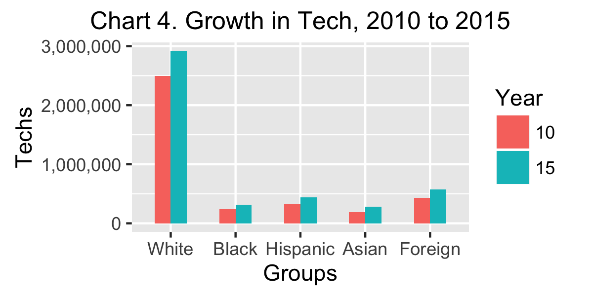
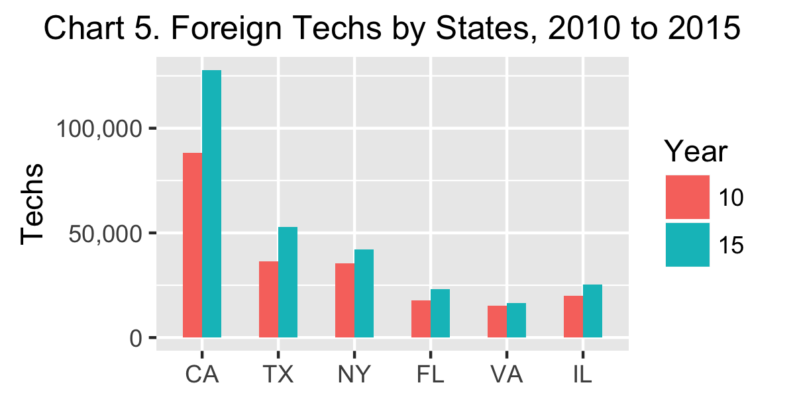

```{r LOAD, echo=FALSE, cache=FALSE}

    #### load("dfRaceWorkplaceAndShares.rda") ### Only use data in tables, plots, and maps
    load("dfCensus2.rda") 
    load("dfTab1A1B2A2B3ABCDEF.rda")
    load("dfTab4.rda")   
    load("dfMap4.rda")
    load("dfPlot5Tab5beta1000.rda")
    load("dfTab67A7B7C7D7E7F8A8B8C8D8E8F.rda")
    load("APPENDIX.rda")  
    
    ###install.packages("gridExtra")
    library(prettydoc)
    library(maps)    
    library(mapproj) ### needed by ggplot2, but not installed automaticallly
    library(ggplot2)
    library(gridExtra)
    ### library(printr)
    library(grid)
    library(gtable)
    library(grid)

    ### Intending to use Yihui Xie's printr package for better tables later
    ### install.packages("devtools")
    ### library(devtools)
    ### install_github("yihui/printr")
    ### library(printr)
    ### detach('package:printr', unload = TRUE)
    
tt3 <- ttheme_minimal(
  core=list(bg_params = list(fill = blues9[1:7], col=NA),
            fg_params=list(fontface=3)),
  colhead=list(fg_params=list(col="navyblue", fontface=4L)),
  rowhead=list(fg_params=list(col="orange", fontface=3L)))

fem10 <- round(dfTable3ZZ[1, "Tech10"] * dfTable3ZZ[1, "perF10"]/100, digits=0) ### calculate females in 2010 from female share
perFemIncrease <- round(100 * (dfTable3Z[1,"Fem"] - fem10)/fem10, digits=1)

```
\pagenumbering{arabic}   

## Overview     
<i>Please note that all of the numbers in this overview and in the subsequent sections are estimates based on U.S. Census survey samples. So all numbers should be read as "approximately" even when the word "approximately" does not appear. </i>  

* blah, blah, blah   

* See Overview of full report <a href="https://archimedes2kxx.github.io/BestStatesForBlackTech/Supplement-3.html#overview" target="_self"><b>HERE</b></a>

  

  

<small><i><center><a href="https://archimedes2kxx.github.io/BestStatesForBlackTech/Supplement-3.html" target="_self">back-to-top</a></center></i></small>   
  
<P style="page-break-before: always">  
## Findings   

Brief answers to the first three sets of questions provide a broad statistical framwork for the extended responses to the fourth question that forms the core of this supplement.   

<i>Please note that the tables, maps, and charts in this supplement about foreign techs have been assigned numbers that follow the numbers of similar tables, maps, and charts in the original report about American techs. For example, Tables 3E and 3F appear in ths supplement because Tables 3A, 3B, 3C, and 3D appeared in the original. On the other hand a few tables from the original are repeated in this supplement as convenient references for the reader and are assigned the same numbers as in the original; for example, Tables 1C and 1E.</i>

#### Question 1 -- How many foreign professionals worked in the U.S. tech sector in 2015?

<i>Answer 1C</i> ...As can be seen from Table 1C (below), `r dfTable1C["Per", "Foreign"]` percent of the U.S. tech sector in 2015 were foreign professionals.  

<b>Table 1C -- American and Foreign Components of the U.S. Tech Sector in 2015</b>    
```{r, echo=FALSE, cache=FALSE, comment=NA}
   print(dfTable1C, row.names=TRUE, quote=FALSE)
```

<i>Question 1E</i> -- How many Asian and non-Asian foreign employees were in U.S. tech in the 50 states plus the District of Columbia in 2015? 

<i>Answer 1E</i> ...  As per Table 1E (below), there were almost three times as many foreign professionals from Asian countries as from other countries in U.S. tech in 2015.
  
<b>Table 1E -- Foreign Asian and Non-Asian Components of the U.S. Tech Sector in 2015</b> 
```{r, echo=FALSE, cache=FALSE, comment=NA}
   print(dfTable1E, row.names=TRUE, quote = FALSE)
```
<small><i><center><a href="https://archimedes2kxx.github.io/BestStatesForBlackTech/Supplement-3.html" target="_self">back-to-top</a></center></i></small>   

<P style="page-break-before: always">   
#### Question 2 -- What was the foreign male/female composition of U.S. tech in 2015?
<i>Answer 2</i> ...As per Table 2C ...


<b>Table 2C -- Foreign Male/Female Components of the U.S. Tech Sector in 2015</b> 
```{r, echo=FALSE, cache=FALSE, comment=NA}
   print(dfTable2C, row.names=TRUE, quote = FALSE)
```
<small><i><center><a href="https://archimedes2kxx.github.io/BestStatesForBlackTech/Supplement-3.html" target="_self">back-to-top</a></center></i></small>   


<P style="page-break-before: always">   


#### Question 3 -- How did the foreign shares of jobs in U.S. tech change between 2010 and 2015?    


The tables in this section display profiles of the foreign professionals employed by U.S. tech. 

This supplement defined "information technology" by using the same thirteen standard occupation categories (SOC) as in the original report. Twelve related to software, e.g., Software Developers and Computer Programmers; one related to hardware, i.e., Computer Hardware Engineers.     

The first column of each table contains a list of job categories. Some categories were abbreviated to enable the rows of the table to be short enough to appear on the same line. Abbreviations include "Comp" for "Computer"; "Info" for "Information"; and "Net" for "Network". Column headings were also abbreviated as follows:   

* <b>Tech10</b> ... the number of tech workers in each job category in 2010   

* <b>Tech15</b> ... the number of tech workers in each job category in 2015   

* <b>perTS</b> ... the "Percentage of Tech Share", which shows the percentage of the total number of American tech workers that were employed in each job category in the 50 states plus the District of Columbia. For example, in Table 3Z (below) the `r prettyNum(dfTable3Z["SOFTWARE DEVELOPERS", "Tech15"], big.mark=",", scientific=FALSE)` workers in "Software Development" represented `r prettyNum(dfTable3Z["SOFTWARE DEVELOPERS", "perTS"], big.mark=",", scientific=FALSE)` percent of the `r prettyNum(dfTable3Z["All Occupations", "Tech15"], big.mark=",", scientific=FALSE)` total American tech workers in 2015. The `r prettyNum(dfTable3Z["COMP PROGRAMMERS", "Tech15"], big.mark=",", scientific=FALSE)` workers "Computer Programmers" were `r prettyNum(dfTable3Z["COMP PROGRAMMERS", "perTS"], big.mark=",", scientific=FALSE)` percent of the total `r prettyNum(dfTable3Z["All Occupations", "Tech15"], big.mark=",", scientific=FALSE)`.   

* <b>Fem</b> ... the number of "Female" tech workers". The number of males can be calculated by substracting the female workers from the total number of workers in each category. For example, in Table 3Z (below) there were `r prettyNum(dfTable3Z["SOFTWARE DEVELOPERS", "Tech15"], big.mark=",", scientific=FALSE)` American software developers in the 50 states plus DC in 2015 of which `r prettyNum(dfTable3Z["SOFTWARE DEVELOPERS", "Fem"], big.mark=",", scientific=FALSE)` were female. So the number of male software developers was `r prettyNum(dfTable3Z["SOFTWARE DEVELOPERS", "Tech15"], big.mark=",", scientific=FALSE)` - `r prettyNum(dfTable3Z["SOFTWARE DEVELOPERS", "Fem"], big.mark=",", scientific=FALSE)` = `r prettyNum((dfTable3Z["SOFTWARE DEVELOPERS", "Tech15"] - dfTable3Z["SOFTWARE DEVELOPERS", "Fem"]), big.mark=",", scientific=FALSE)`. 

* <b>perF15</b> ... the "Percent Female in 2015" displays the percent of jobs in each category that were held by female techs in 2015. For example, Table 3Z shows that the `r prettyNum(dfTable3Z["SOFTWARE DEVELOPERS", "Fem"], big.mark=",", scientific=FALSE)` female software developers were `r prettyNum(dfTable3Z["SOFTWARE DEVELOPERS", "perF15"], big.mark=",", scientific=FALSE)` percent of the total `r prettyNum(dfTable3Z["SOFTWARE DEVELOPERS", "Tech15"], big.mark=",", scientific=FALSE)`

* <b>perF10</b> ... the "Percent Female in 2010" displays the percent of jobs in each category that were held by female techs in 2010. This stat is always contained in the companion table, e.g., Table 3ZZ.

* <b>Change</b> ... the difference between the number of workers in each job category in 2010 and the number in 2015. This stat is always found in the companion table, e.g., Table 3ZZ. 

* <b>perCh</b> ... the change from 2010 to 2015 as a percentage of the jobs in 2010.  

<small><i><center><a href="https://archimedes2kxx.github.io/BestStatesForBlackTech/Supplement-3.html" target="_self">back-to-top</a></center></i></small>  


<P style="page-break-before: always">   
 <b>Table 3E -- Foreign Male/Female Composition of U.S. Tech in 2015</b> 
```{r, echo=FALSE, cache=FALSE, comment=NA}
   print(format(dfTable3E, big.mark=","), row.names=FALSE, quote=FALSE)
```

<P style="page-break-before: always">    
 <b>Table 3EE -- Changes in the Foreign Composition of U.S. Tech Between 2010 and 2015</b> 
```{r, echo=FALSE, cache=FALSE, comment=NA}
   print(format(dfTable3EE, big.mark=","), row.names=FALSE, quote=FALSE)
```
<small><i><center><a href="https://archimedes2kxx.github.io/BestStatesForBlackTech/Supplement-3.html" target="_self">back-to-top</a></center></i></small>  


<P style="page-break-before: always">   
 <b>Table 3F -- Foreign Asian Male/Female Composition of U.S. Tech in 2015</b> 
```{r, echo=FALSE, cache=FALSE, comment=NA}
   print(format(dfTable3F, big.mark=","), row.names=FALSE, quote=FALSE)
```

<P style="page-break-before: always">    
 <b>Table 3FF -- Changes in the Foreign Asian Composition of U.S. Tech Between 2010 and 2015</b> 
```{r, echo=FALSE, cache=FALSE, comment=NA}
   print(format(dfTable3FF, big.mark=","), row.names=FALSE, quote=FALSE)
```
<small><i><center><a href="https://archimedes2kxx.github.io/BestStatesForBlackTech/Supplement-3.html" target="_self">back-to-top</a></center></i></small>  


<P style="page-break-before: always">   
 <b>Table 3G -- Key Jobs for Foreign Professionals in the Tech Sectors of the Big Six States</b> 
```{r, echo=FALSE, cache=FALSE, comment=NA}
   print(format(dfTable3G, big.mark=","), row.names=FALSE, quote=FALSE)
```

<small><i><center><a href="https://archimedes2kxx.github.io/BestStatesForBlackTech/Supplement-3.html" target="_self">back-to-top</a></center></i></small>  


<P style="page-break-before: always">    
#### Question 4 -- Where did foreign techs work in 2015?      
Answer 4 ... The following sections provide an extensive response to a more specific formulation of this question ==> In which states did foreign tech professionals work in 2015?  

Table 4 (below) lists the six states that employed the most American techs in 2015, i.e.,  (`r prettyNum(dfTable4[1, "perTop6"])` percent) of the `r prettyNum(dfTable4[1, "ALL STATES"], big.mark=",", scientific=FALSE)`. This section demonstrates that the Big Six also employed the most foreign techs in 2015. 

<b>Table 4 ... Biggest Half-Dozen Tech States in 2015</b>
```{r, echo=FALSE, cache=FALSE, comment=NA}
colnames(dfTable4) <- c("ALL STATES", "CA", "TX", "NY", "FL", "VA", "IL", "Total", "perT6")

print(format(dfTable4[,c(1:7,9)], big.mark = "," , rownames=FALSE ))
```

<small><i><center><a href="https://archimedes2kxx.github.io/BestStatesForBlackTech/Supplement-3.html" target="_self">back-to-top</a></center></i></small>   


```{r, echo=FALSE, cache=FALSE, comment=NA}
    grid.arrange(dfMap4G, dfMap4H, ncol=2) 
``` 


<P style="page-break-before: always">  
<b>Table 4G -- Foreign Asian Professionals in U.S. Information Technology -- Top 10 States </b>   
<i>[Click here for full version](Table4G-Full-Foreign-Asia-Employment.html)</i>
```{r, echo=FALSE, cache=FALSE, comment=NA}
    ### Change of column names is permanent from here on ... matches displayed colum names
    colnames(dfTable4G) <- c("State", "AllForeign", "perSS", "Asian", "perAsian")
print(format(dfTable4G[1:11,], big.mark = ","), row.names=FALSE)  
```

<small><i><center><a href="https://archimedes2kxx.github.io/BestStatesForBlackTech/Supplement-3.html" target="_self">back-to-top</a></center></i></small>


<P style="page-break-before: always">  
<b>Table 4H -- Foreign Non-Asian Professionals in U.S. Information Technology -- Top 10 States </b>   
<i>[Click here for full version](Table4H-Full-Foreign-Not-Asia-Employment.html)</i>
```{r, echo=FALSE, cache=FALSE, comment=NA}
    ### Change of column names is permanent from here on ... matches displayed colum names
    colnames(dfTable4H) <- c("State", "AllForeign", "perSS", "NonAsian", "perNonAsian")
print(format(dfTable4H[1:11,], big.mark = ","), row.names=FALSE)  
```

<small><i><center><a href="https://archimedes2kxx.github.io/BestStatesForBlackTech/Supplement-3.html" target="_self">back-to-top</a></center></i></small>

<P style="page-break-before: always">  
## Final Comments</b>   

<small><i><center><a href="https://archimedes2kxx.github.io/BestStatesForBlackTech/Supplement-3.html" target="_self">back-to-top</a></center></i></small> 
    
<P style="page-break-before: always">  
## Personal Motivation   

<small><i><center><a href="https://archimedes2kxx.github.io/BestStatesForBlackTech/Supplement-3.html" target="_self">back-to-top</a></center></i></small> 
      
<P style="page-break-before: always">  
## Methods   

<small><i><center><a href="https://archimedes2kxx.github.io/BestStatesForBlackTech/Supplement-3.html" target="_self">back-to-top</a></center></i></small> 
 
<P style="page-break-before: always">    
## Appendix -- Job Profiles of Foreign Professionals in Big Six Tech States in 2015

As per Table 4 in the supplement, the six states in this appendix employed the largest number of Americans in their tech sectors -- California, Texas, New York, Florida, Virginia, and Illinois. This appendix displays job profiles of the foreign techs employed by each of these states. Two pairs of tables are included for each state.

* The first pair of tables displays job profiles of all foreign techs; the second pair of tables display job profiles for foreign techs from Asia

* The first table in each pair shows the distribution of foreign techs in the 13 job catebories in 2015; the second table in each pair shows the growth or decline of foreign techs in each job category between 2010 and 2015.   

In a future version of the supplement, this Appendix will be replaced by an interactive dashboard that will allow users to display pairs of tables for any state of the fifty states and DC, and for any American or foreign group.   

<i>Note: The column headings and abbreviated row names of the tables in this appendix are explained in the answer to [<b>Question 3](https://archimedes2kxx.github.io/BestStatesForBlackTech/Supplement-3.html#question-3-how-did-the-foreign-shares-of-jobs-in-u.s.-tech-change-between-2010-and-2015)</b> in the body of the supplement</i>

<P style="page-break-before: always">        
### California ... California ...California ... California ...   
  
 <b>Table 3.forCA -- Foreign Male/Female Composition of Tech in California in 2015</b> 
```{r, echo=FALSE, cache=FALSE, comment=NA}
   print(format(dfTable3forCA, big.mark=","), row.names=FALSE, quote=FALSE)
```

<P style="page-break-before: always">    
 <b>Table 3.forCACA -- Changes in the Foreign Composition of Tech In California between 2010 and 2015</b> 
```{r, echo=FALSE, cache=FALSE, comment=NA}
   print(format(dfTable3forCACA, big.mark=","), row.names=FALSE, quote=FALSE)
```
<small><i><center><a href="https://archimedes2kxx.github.io/BestStatesForBlackTech/Supplement-3.html" target="_self">back-to-top</a></center></i></small>  


<P style="page-break-before: always">   
 <b>Table 3.forAsianCA -- Foreign Asian Male/Female Composition of Tech in California in 2015</b> 
```{r, echo=FALSE, cache=FALSE, comment=NA}
   print(format(dfTable3forAsianCA, big.mark=","), row.names=FALSE, quote=FALSE)
```

<P style="page-break-before: always">    
 <b>Table 3.forAsianCACA -- Changes in the Foreign Asian Composition of Tech In California between 2010 and 2015</b> 
```{r, echo=FALSE, cache=FALSE, comment=NA}
   print(format(dfTable3forAsianCACA, big.mark=","), row.names=FALSE, quote=FALSE)
```
<small><i><center><a href="https://archimedes2kxx.github.io/BestStatesForBlackTech/Supplement-3.html" target="_self">back-to-top</a></center></i></small>     


<P style="page-break-before: always">    
### Texas ... Texas ... Texas ... Texas ... Texas ...   
 
 <b>Table 3.forTX -- Foreign Male/Female Composition of Tech in Texas in 2015</b> 
```{r, echo=FALSE, cache=FALSE, comment=NA}
   print(format(dfTable3forTX, big.mark=","), row.names=FALSE, quote=FALSE)
```

<P style="page-break-before: always">    
 <b>Table 3.forTXTX -- Changes in the Foreign Composition of Tech In Texas between 2010 and 2015</b> 
```{r, echo=FALSE, cache=FALSE, comment=NA}
   print(format(dfTable3forTXTX, big.mark=","), row.names=FALSE, quote=FALSE)
```
<small><i><center><a href="https://archimedes2kxx.github.io/BestStatesForBlackTech/Supplement-3.html" target="_self">back-to-top</a></center></i></small>  


<P style="page-break-before: always">   
 <b>Table 3.forAsianTX -- Foreign Asian Male/Female Composition of Tech in Texas in 2015</b> 
```{r, echo=FALSE, cache=FALSE, comment=NA}
   print(format(dfTable3forAsianTX, big.mark=","), row.names=FALSE, quote=FALSE)
```

<P style="page-break-before: always">    
 <b>Table 3.forAsianTXTX -- Changes in the Foreign Asian Composition of Tech In Texas between 2010 and 2015</b> 
```{r, echo=FALSE, cache=FALSE, comment=NA}
   print(format(dfTable3forAsianTXTX, big.mark=","), row.names=FALSE, quote=FALSE)
```
<small><i><center><a href="https://archimedes2kxx.github.io/BestStatesForBlackTech/Supplement-3.html" target="_self">back-to-top</a></center></i></small>     

   
<P style="page-break-before: always">    
### New York ... New York ... New York ...  
   
 <b>Table 3.forNY -- Foreign Male/Female Composition of Tech in New York in 2015</b> 
```{r, echo=FALSE, cache=FALSE, comment=NA}
   print(format(dfTable3forNY, big.mark=","), row.names=FALSE, quote=FALSE)
```

<P style="page-break-before: always">    
 <b>Table 3.forNYNY -- Changes in the Foreign Composition of Tech In New York between 2010 and 2015</b> 
```{r, echo=FALSE, cache=FALSE, comment=NA}
   print(format(dfTable3forNYNY, big.mark=","), row.names=FALSE, quote=FALSE)
```
<small><i><center><a href="https://archimedes2kxx.github.io/BestStatesForBlackTech/Supplement-3.html" target="_self">back-to-top</a></center></i></small>  


<P style="page-break-before: always">   
 <b>Table 3.forAsianNY -- Foreign Asian Male/Female Composition of Tech in New York in 2015</b> 
```{r, echo=FALSE, cache=FALSE, comment=NA}
   print(format(dfTable3forAsianNY, big.mark=","), row.names=FALSE, quote=FALSE)
```

<P style="page-break-before: always">    
 <b>Table 3.forAsianNYNY -- Changes in the Foreign Asian Composition of Tech In New York between 2010 and 2015</b> 
```{r, echo=FALSE, cache=FALSE, comment=NA}
   print(format(dfTable3forAsianNYNY, big.mark=","), row.names=FALSE, quote=FALSE)
```
<small><i><center><a href="https://archimedes2kxx.github.io/BestStatesForBlackTech/Supplement-3.html" target="_self">back-to-top</a></center></i></small>     

 
<P style="page-break-before: always">    
### Florida ... Florida ... Florida ...  
 
 <b>Table 3.forFL -- Foreign Male/Female Composition of Tech in Florida in 2015</b> 
```{r, echo=FALSE, cache=FALSE, comment=NA}
   print(format(dfTable3forFL, big.mark=","), row.names=FALSE, quote=FALSE)
```

 <b>Table 3.forFLFL -- Changes in the Foreign Composition of Tech In Florida between 2010 and 2015</b> 
```{r, echo=FALSE, cache=FALSE, comment=NA}
   print(format(dfTable3forFLFL, big.mark=","), row.names=FALSE, quote=FALSE)
```
<small><i><center><a href="https://archimedes2kxx.github.io/BestStatesForBlackTech/Supplement-3.html" target="_self">back-to-top</a></center></i></small>  


<P style="page-break-before: always">   
 <b>Table 3.forAsianFL -- Foreign Asian Male/Female Composition of Tech in Florida in 2015</b> 
```{r, echo=FALSE, cache=FALSE, comment=NA}
   print(format(dfTable3forAsianFL, big.mark=","), row.names=FALSE, quote=FALSE)
```

 <b>Table 3.forAsianFLFL -- Changes in the Foreign Asian Composition of Tech In Florida between 2010 and 2015</b> 
```{r, echo=FALSE, cache=FALSE, comment=NA}
   print(format(dfTable3forAsianFLFL, big.mark=","), row.names=FALSE, quote=FALSE)
```
<small><i><center><a href="https://archimedes2kxx.github.io/BestStatesForBlackTech/Supplement-3.html" target="_self">back-to-top</a></center></i></small>     
 

<P style="page-break-before: always">        
### Virginia ... Virginia ...  
    
  
 <b>Table 3.forVA -- Foreign Male/Female Composition of Tech in Virginia in 2015</b> 
```{r, echo=FALSE, cache=FALSE, comment=NA}
   print(format(dfTable3forVA, big.mark=","), row.names=FALSE, quote=FALSE)
```

<P style="page-break-before: always">    
 <b>Table 3.forVAVA -- Changes in the Foreign Composition of Tech In Virginia between 2010 and 2015</b> 
```{r, echo=FALSE, cache=FALSE, comment=NA}
   print(format(dfTable3forVAVA, big.mark=","), row.names=FALSE, quote=FALSE)
```
<small><i><center><a href="https://archimedes2kxx.github.io/BestStatesForBlackTech/Supplement-3.html" target="_self">back-to-top</a></center></i></small>  


<P style="page-break-before: always">   
 <b>Table 3.forAsianVA -- Foreign Asian Male/Female Composition of Tech in Virginia in 2015</b> 
```{r, echo=FALSE, cache=FALSE, comment=NA}
   print(format(dfTable3forAsianVA, big.mark=","), row.names=FALSE, quote=FALSE)
```

<P style="page-break-before: always">    
 <b>Table 3.forAsianVAVA -- Changes in the Foreign Asian Composition of Tech In Virginia between 2010 and 2015</b> 
```{r, echo=FALSE, cache=FALSE, comment=NA}
   print(format(dfTable3forAsianVAVA, big.mark=","), row.names=FALSE, quote=FALSE)
```
<small><i><center><a href="https://archimedes2kxx.github.io/BestStatesForBlackTech/Supplement-3.html" target="_self">back-to-top</a></center></i></small>     

  
  
  

<P style="page-break-before: always">    
### Illinois ...  
 
  
 <b>Table 3.forIL -- Foreign Male/Female Composition of Tech in Illinois in 2015</b> 
```{r, echo=FALSE, cache=FALSE, comment=NA}
   print(format(dfTable3forIL, big.mark=","), row.names=FALSE, quote=FALSE)
```

<P style="page-break-before: always">    
 <b>Table 3.forILIL -- Changes in the Foreign Composition of Tech In Illinois between 2010 and 2015</b> 
```{r, echo=FALSE, cache=FALSE, comment=NA}
   print(format(dfTable3forILIL, big.mark=","), row.names=FALSE, quote=FALSE)
```
<small><i><center><a href="https://archimedes2kxx.github.io/BestStatesForBlackTech/Supplement-3.html" target="_self">back-to-top</a></center></i></small>  


<P style="page-break-before: always">   
 <b>Table 3.forAsianIL -- Foreign Asian Male/Female Composition of Tech in Illinois in 2015</b> 
```{r, echo=FALSE, cache=FALSE, comment=NA}
   print(format(dfTable3forAsianIL, big.mark=","), row.names=FALSE, quote=FALSE)
```

<P style="page-break-before: always">    
 <b>Table 3.forAsianILIL -- Changes in the Foreign Asian Composition of Tech In Illinois between 2010 and 2015</b> 
```{r, echo=FALSE, cache=FALSE, comment=NA}
   print(format(dfTable3forAsianILIL, big.mark=","), row.names=FALSE, quote=FALSE)
```
<small><i><center><a href="https://archimedes2kxx.github.io/BestStatesForBlackTech/Supplement-3.html" target="_self">back-to-top</a></center></i></small>     


